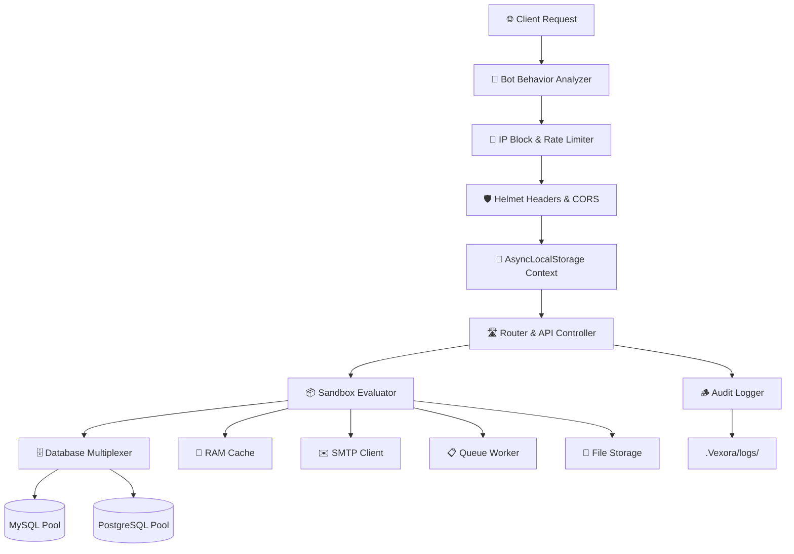

<p align="center">
  
</p>

<h1 align="center">⚡ Vexora Framework</h1>

<p align="center">
  <strong>The Backend Master — Enterprise-Grade, Blazing-Fast, Zero-Dependency Node.js Engine</strong>
</p>

<p align="center">
  <a href="https://www.npmjs.com/package/vexora"></a>
  <a href="https://opensource.org/licenses/MIT"></a>
  
  
  
</p>

<p align="center">
  Build high-performance REST APIs, real-time WebSockets, encrypted file storage, background job queues,<br/>
  and complex database-driven architectures — all without a single third-party dependency.
</p>

---

<details>
<summary><strong>📑 Table of Contents</strong> <em>(click to expand)</em></summary>

#### Getting Started
- [Key Features](#key-features)
- [Framework Comparison](#framework-comparison)
- [Installation](#installation)
- [Quick Start](#quick-start)
- [Architecture](#architecture)
- [Absolute Imports & Named Exports](#absolute-imports)

#### Core Systems
- [API Routing](#api-routing)
- [Standard Routing & Controllers](#routing)
- [Database & CRUD](#database)
- [Serving Static Files](#static-files)

#### Security & Auth
- [CSRF Protection](#csrf-protection)
- [Token Vault](#token-vault)
- [CAPTCHA Verification](#captcha)
- [Bot Shield & Behavior Analyzer](#bot-shield)
- [IP Blocking](#ip-blocking)
- [Rate Limiting](#rate-limiting)
- [Suspicious Activity Throttling](#suspicious-throttling)

#### Built-in Engines
- [RAM Cache (Redis Mock)](#ram-cache)
- [WebSockets](#websockets)
- [SMTP Mail Client](#smtp-mail)
- [HTTP Client](#http-client)
- [Queue & Background Jobs](#queue-jobs)
- [Task Scheduler & Cron](#task-scheduler)
- [File Storage & Encryption](#file-upload)

#### API Reference
- [Cryptographic Helpers](#crypto-helpers)
- [Request & Response](#request-response)
- [Sessions](#sessions)
- [Input Validation](#validation)

#### Meta
- [License](#license)

</details>

---

<a id="key-features"></a>

## ✨ Key Features

| Category | Feature | Description |
|:---------|:--------|:------------|
| 🏗️ **Core** | **Zero-Dependency Architecture** | Built 100% on Node.js native modules (`http`, `crypto`, `events`, `async_hooks`). Only optional DB drivers (`mysql2`, `pg`) for database connections. |
| ⚡ **Performance** | **~90,000 req/sec Throughput** | Shallow call stacks interfacing directly with TCP sockets outperform Express (~15K) and Fastify (~60K). |
| 🧵 **Context** | **Thread-Safe Request Binding** | Native `AsyncLocalStorage` maps request/response/session globally across all files — zero parameter drilling. |
| 🔌 **Real-time** | **Native WebSocket Server** | Optimized TCP frame parser with binary mask/unmask built directly into the core stream layer. |
| 🗄️ **Database** | **Multi-Pool DB Routing** | Simultaneous MySQL + PostgreSQL pools with auto-escaping, entity quoting, pagination, and nested savepoints. |
| 💾 **Cache** | **Sub-μs RAM Cache** | In-memory TTL store with atomic counters, garbage collection, and strict RAM limit enforcement. |
| ✉️ **Mail** | **Native SMTP Client** | Raw TCP/TLS socket construction — SSL, STARTTLS, AUTH LOGIN, Base64 challenges, multipart payloads. |
| 🔒 **Security** | **Hardened by Default** | Timing-safe CSRF, Helmet headers, global rate limiting, bot jitter analysis, IP blocking, and auto-trimmed inputs. |
| 📁 **Storage** | **Encrypted File Uploads** | AES-256-CBC encryption, magic-byte MIME validation, device-bound upload tokens, and path traversal guards. |
| 🪵 **Logging** | **Silent Audit Trails** | Auto-masks passwords/tokens/CVVs, conceals server paths, issues UUID error trackers to clients. |

---

<a id="framework-comparison"></a>

## 📊 Framework Comparison

### ⚡ Performance & Built-in Features

| Feature | Express.js 🐢 | Fastify ⚡ | **Vexora 🚀** |
|:--------|:--------------|:----------|:-------------|
| **Throughput** | ~15,000 req/s | ~60,000 req/s | **~90,000 req/s** |
| **Dependencies** | Dozens of packages | Several packages | **Zero (Node.js core only)** |
| **Request Context** | Parameter drilling | Parameter drilling | **Global `AsyncLocalStorage`** |
| **WebSockets** | Requires `socket.io` / `ws` | Requires plugin | **Native TCP layer** |
| **Database** | Requires ORM (Prisma, etc.) | Requires ORM | **Built-in multi-pool multiplexer** |
| **Security** | Manual configuration | Plugin-based | **Hardened by default** |
| **Error Logging** | Exposes stack traces | Standard logging | **UUID-masked silent logging** |

### 🔒 Security Ratings

| Feature | Express.js | Fastify | **Vexora** |
|:--------|:-----------|:--------|:-----------|
| CSRF Protection | ⭐⭐☆☆☆ | ⭐⭐⭐☆☆ | ⭐⭐⭐⭐⭐ |
| SQL Injection Defense | ⭐☆☆☆☆ | ⭐☆☆☆☆ | ⭐⭐⭐⭐⭐ |
| Security Headers | ⭐☆☆☆☆ | ⭐⭐⭐☆☆ | ⭐⭐⭐⭐⭐ |
| DDoS / Rate Limiting | ⭐☆☆☆☆ | ⭐⭐⭐☆☆ | ⭐⭐⭐⭐⭐ |
| Session Hijacking Guard | ⭐⭐☆☆☆ | ⭐⭐⭐☆☆ | ⭐⭐⭐⭐⭐ |
| Error Path Leakage | ⭐☆☆☆☆ | ⭐⭐⭐⭐☆ | ⭐⭐⭐⭐⭐ |
| Sensitive Field Masking | ⭐☆☆☆☆ | ⭐⭐☆☆☆ | ⭐⭐⭐⭐⭐ |
| **Overall Grade** | **C-** | **B** | **A+** |

### 🚀 Exclusive Built-in Engines

| Engine | Express.js | Fastify | **Vexora** |
|:-------|:-----------|:--------|:-----------|
| Native SMTP Mail Client | ❌ Requires `nodemailer` | ❌ Plugin | ✅ **Built-in (TCP/TLS)** |
| Background Queue & Cron | ❌ Requires `bull` / `node-cron` | ❌ Plugin | ✅ **Built-in** |
| Bot Jitter & Scanner Shield | ❌ Vulnerable | ❌ Custom scripts | ✅ **Built-in** |
| Sub-μs RAM Cache | ❌ External Redis | ❌ External Redis | ✅ **Built-in** |
| Encrypted File Storage | ❌ `multer` + custom crypto | ❌ Plugin | ✅ **Built-in (AES-256)** |

---

<a id="installation"></a>

## 📦 Installation

```bash
npm install vexora
```

> [!NOTE]
> Vexora requires **Node.js v18.0.0** or higher. Database drivers (`mysql2`, `pg`) are included as optional peer dependencies and only loaded when a database connection is configured.

---

<a id="quick-start"></a>

## 🚀 Quick Start

### Step 1 — Create Your Server

```javascript
// index.js
import Vexora from "vexora";

// Start the Vexora server on port 3000
// This auto-connects API controllers, static serving, and security middleware
const app = Vexora.start(3000);

// Define routes using the Vexora signature
// Supported verbs: get, post, put, patch, delete, any
app.Vexora(get, "/", (req, res) => {
    return res.success({ hello: "world" }, "Welcome to Vexora!");
});

app.Vexora(post, "/submit", (req, res) => {
    return res.success(req.all(), "Data processed successfully!");
});
```

### Step 2 — Run

```bash
node index.js
```

```
⚡ Vexora Engine v1.0.4 Initialized in 1.82ms.
🚀 Vexora Server is running at http://localhost:3000
```

### Step 3 — Test

```bash
curl http://localhost:3000/
```

```json
{
  "status": true,
  "message": "Welcome to Vexora!",
  "data": { "hello": "world" },
  "execution_time": "0.42ms"
}
```

> [!TIP]
> **First Boot**: When Vexora starts for the first time, it automatically creates a `.Vexora/config` file in your project root with all default configuration keys. Edit this file to customize security, database, SMTP, and cache settings.

> [!NOTE]
> **Routing Precedence:**
> 1. **Static Files** (`public/`) — Highest priority
> 2. **API Controllers** (`.Vexora_Api/`) — Second priority
> 3. **Custom Routes** (`app.Vexora()`) — Fallback

---

<a id="architecture"></a>

## ⚙️ Internal Architecture



### How It Works

| Layer | Description |
|:------|:------------|
| **Context Binding** | Node's native `AsyncLocalStorage` isolates each request into its own storage cell. Methods like `Vexora.Request.input()` access this cell globally — no `req`/`res` parameter drilling needed. |
| **Sandbox Evaluator** | Route autoloader scans folders and evaluates scripts using `new AsyncFunction('Vexora', 'req', 'res', 'db', 'params', code)`. Variables are pre-injected. Runtime errors log silently with UUID trackers. |
| **Database Multiplexer** | Connections are lazy-loaded and cached in a global pool map. Table/column identifiers are validated against strict regexes and wrapped in engine-specific quotes (`` ` `` for MySQL, `"` for PostgreSQL). |
| **Security Pipeline** | Every request passes through Bot Analysis → IP Block Check → Rate Limiter → Suspicious Tracker → Helmet Headers → CORS before reaching your handler. |

---

<a id="api-routing"></a>

## 🗂️ Directory-Based API Routing

Vexora supports automatic **`.Vexora_Api` directory-based routing**. When the server boots, it creates a `.Vexora_Api` directory. Any request starting with `/api` is routed exclusively to files inside this directory.

### Direct File Execution (Zero Boilerplate)

Drop a JavaScript file into `.Vexora_Api/` — it's automatically mapped to a route:

```
.Vexora_Api/profile.js  →  GET http://localhost:3000/api/profile
```

### Module-Based Sub-Routers

For organized, modular routes, create sub-folders with an `index.js` router:

#### Define the Router

```javascript
// .Vexora_Api/auth/index.js
const authRouter = new Vexora.RouteController();

authRouter.post('/login', 'login');    // → .Vexora_Api/auth/login.js
authRouter.get('/profile', 'profile'); // → .Vexora_Api/auth/profile.js

export default authRouter;
```

#### Create an Action Script

```javascript
// .Vexora_Api/auth/login.js
// No imports needed! Vexora, req, res, db, params are pre-injected.

const username = req.body.username;

const user = await Vexora.fetch("SELECT * FROM users WHERE username = ?", [username]);

if (!user) {
    Vexora.Response.error("Invalid credentials!", 401);
} else {
    Vexora.Response.success(user, "Login successful!");
}
```

---

<a id="routing"></a>

## 🛣️ Standard Routing & Custom Controllers

Beyond `/api` routing, Vexora supports mounting sub-routers in custom directories:

### Define a Sub-Router

```javascript
// auth/index.js
const authRouter = new Vexora.RouteController();

// Map HTTP methods to controller script files
authRouter.get('/profile', 'profile');        // GET /auth/profile → auth/profile.js
authRouter.post('/login', 'login');           // POST /auth/login  → auth/login.js

// Match multiple HTTP verbs
authRouter.match(['GET', 'POST'], '/register', 'register');

// Query parameters (recommended for flexibility)
authRouter.get('/users', 'view_user');        // /auth/users?id=42

// Catch-all handler
authRouter.any('/:any', (req, res) => {
    return res.error("Action not found!", 404);
});

export default authRouter;
```

### Controller Action Script

```javascript
// auth/view_user.js — NO imports needed!

const userId = req.query.id;

const user = await Vexora.fetch("SELECT * FROM users WHERE id = ? LIMIT 1", [userId]);

if (!user) {
    Vexora.Response.error("User not found!", 404);
} else {
    Vexora.Response.success(user, "User details loaded successfully!");
}
```

> [!TIP]
> **Why Query Parameters (`?id=value`) are recommended:**
> - **Flexibility**: Pass unlimited parameters (filtering, sorting, paging) without altering route paths
> - **Scalability**: Route mapping stays clean and static, avoiding complex regex overhead
>
> *Vexora also supports path parameters (`/users/:id` → `params.id`) if your design demands strict URL hierarchies.*

### Global Server Lockdown

```javascript
// Full lockdown — blocks all HTTP traffic with 404
Vexora.protect();       // or Vexora.protect("full")

// Browser-only lockdown — blocks direct URL navigation, allows fetch/XHR/Axios
Vexora.protect("browser");  // or Vexora.protect("url")
```

---

<a id="static-files"></a>

## 📁 Serving Static Files

Vexora includes a native, stream-based static asset server with caching headers, traversal protection, and PHP-CGI execution:

```javascript
import Vexora from "vexora";

const app = Vexora.start(3000);

// Configure static file serving
app.static("public", "home.html", {
    maxAge: 86400,
    rateLimit: {
        maxRequests: 150,
        windowSeconds: 60
    }
});
```

**Features:**
- **PHP-CGI Execution**: `.php`, `.html`, `.htm` files with embedded PHP tags are auto-executed via `php-cgi`
- **Custom Default Index**: Specify any file as the directory index (e.g., `home.html`, `index.php`)
- **404 Handling**: Missing index files return proper `404` status codes

### Custom Error Pages

Place HTML files in `.Vexora_error/` directory for custom error pages:

| File | Purpose |
|:-----|:--------|
| `.Vexora_error/404.html` | Route / File Not Found |
| `.Vexora_error/403.html` | Blocked IPs / Security Denials |
| `.Vexora_error/500.html` | Runtime Internal Server Errors |

---

<a id="database"></a>

## 🗄️ Multi-Connection Database Routing & CRUD

> [!IMPORTANT]
> **Database Setup:** Configure connection pools in `.Vexora/db_config.json`:
> ```json
> {
>   "auth": {
>     "DB_HOST": "127.0.0.1",
>     "DB_NAME": "auth_db",
>     "DB_USER": "root",
>     "DB_PASS": "secure_password",
>     "DB_DRIVER": "mysql"
>   }
> }
> ```
> Pass the configuration key (e.g., `"auth"`) as the first parameter to any database method. If omitted, Vexora uses the first pool defined in `db_config.json`.

### Fetching Data

```javascript
// Fetch a single row (returns object or null)
const user = await Vexora.fetch("auth", "SELECT * FROM users WHERE id = ?", [1]);

// Fetch all matching rows (returns array)
const users = await Vexora.fetchAll("auth", "SELECT * FROM users WHERE status = ?", ["active"]);

// Fetch a single column value directly
const balance = await Vexora.fetchColumn("auth", "SELECT balance FROM users WHERE id = ?", [1]);

// Raw query (returns full result set)
const rows = await Vexora.query("auth", "SELECT * FROM logs");

// Execute DDL/non-select statements
await Vexora.execute("auth", "CREATE TABLE IF NOT EXISTS ...");
```

### CRUD Helpers

All table and column identifiers are auto-sanitized and quoted (`` ` `` for MySQL, `"` for PostgreSQL) to block SQL injection at the schema level.

```javascript
// INSERT — returns auto-increment primary key ID
const userId = await Vexora.insert("auth", "users", {
    email: "john@example.com",
    username: "john_doe",
    status: "active"
});

// UPDATE — returns affected rows count
const affected = await Vexora.update(
    "auth", "users",
    { status: "suspended" },
    "id = ?", [userId]
);

// DELETE
await Vexora.delete("auth", "users", "id = ?", [userId]);

// EXISTS — returns boolean
const exists = await Vexora.exists("auth", "users", "email = ?", ["test@email.com"]);

// COUNT — returns number
const total = await Vexora.count("auth", "users", "status = ?", ["active"]);
```

### Pagination

```javascript
const page = await Vexora.paginate(
    "auth",
    "SELECT * FROM users WHERE status = ?",
    ["active"],
    1,   // Page number
    10   // Items per page
);

console.log(page.items);         // Array of rows
console.log(page.total_items);   // Total matching records
console.log(page.total_pages);   // Calculated page count
console.log(page.has_next);      // true / false
```

### Nested Savepoint Transactions

Vexora manages nested savepoint levels (`SAVEPOINT trans{level}`) automatically:

```javascript
await Vexora.begin("auth");
try {
    await Vexora.insert("auth", "logs", { log_type: "parent" });

    await Vexora.begin("auth"); // Nested savepoint
    try {
        await Vexora.update("auth", "users", { balance: 100 }, "id = ?", [1]);
        await Vexora.commit("auth"); // Release inner savepoint
    } catch (innerErr) {
        await Vexora.rollback("auth"); // Rollback to outer savepoint
    }

    await Vexora.commit("auth"); // Commit all
} catch (err) {
    await Vexora.rollback("auth"); // Rollback entire transaction
}
```

### Table Creation

```javascript
const sql = `
    CREATE TABLE IF NOT EXISTS projects (
        id INT AUTO_INCREMENT PRIMARY KEY,
        public_id VARCHAR(255) NULL,
        user_id INT NULL,
        name VARCHAR(255) NOT NULL,
        status VARCHAR(50) DEFAULT 'pending',
        created_at TIMESTAMP DEFAULT CURRENT_TIMESTAMP
    ) ENGINE=InnoDB DEFAULT CHARSET=utf8mb4;
`;

await Vexora.execute("auth", sql);
```

---

<a id="csrf-protection"></a>

## 🛡️ CSRF Protection

Vexora includes a timing-safe, device-bound, session-bound CSRF token system:

```javascript
import Vexora from "vexora";

// Generate a device-bound CSRF token
const csrfToken = Vexora.csrf.generate({
    bindDevice: true,   // Bind to User-Agent
    bindIp: true,       // Bind to client IP
    bindSession: true,  // Bind to active session
    maxUses: 1,         // Single-use (token rotation)
    ttl: "1H"
});

// Verify — Option A: Sealed TokenVault CSRF token
if (Vexora.csrf.verify(req.headers["x-csrf-token"])) {
    console.log("✅ CSRF Verified!");
}

// Verify — Option B: Constant-time direct comparison
if (Vexora.csrf.verify(clientToken, serverSessionToken)) {
    console.log("✅ Token matches!");
}
```

---

<a id="token-vault"></a>

## 🗝️ Token Vault

The `TokenVault` provides cryptographically-hardened payload sealing using HKDF key derivation + AES-256-GCM encryption with optional environment bindings:

### Configure

```javascript
Vexora.TokenVault.configure(
    { key_v1: "master-key-secret-must-be-at-least-16-chars" },
    "my-app-issuer",
    "my-app-audience"
);
```

### Seal (Create Token)

```javascript
const result = Vexora.TokenVault.seal(
    { userId: 42, role: "admin" },  // Payload
    "user-unique-secret",            // User key (HKDF derivation)
    "1H",                            // Duration: "30M", "1H", "2D"
    "auth",                          // Purpose
    0,                               // nbfOffset (Not Before)
    false,                           // bindSession
    true,                            // bindIp
    true,                            // bindDevice
    1                                // maxUses (0 = unlimited)
);

if (result.status) {
    console.log("Token:", result.token);   // "key_v1.ciphertext"
    console.log("JTI:", result.jti);       // UUID for tracking
    console.log("Expires:", result.exp);   // UNIX timestamp
}
```

### Unseal (Verify & Decrypt)

```javascript
const result = Vexora.TokenVault.unseal(token, "user-unique-secret", "auth");

if (result.status) {
    console.log("Data:", result.data);     // { userId: 42, role: "admin" }
    console.log("Claims:", result.claims); // iss, aud, iat, exp, etc.
} else {
    console.error("Failed:", result.error);
    // "Token expired", "IP binding failed", "Purpose mismatch"
}
```

---

<a id="crypto-helpers"></a>

## 🔐 Cryptographic Helpers

```javascript
// Scrypt password hashing & timing-safe verification
const hashed  = Vexora.Helper.hashPassword("my_secret_pass");
const isValid = Vexora.Helper.verifyPassword("my_secret_pass", hashed);

// AES-256-GCM authenticated encryption (uses AES_SECRET from config)
const encrypted = Vexora.Helper.encrypt("sensitive information");
const decrypted = Vexora.Helper.decrypt(encrypted);

// Secure random generation
const token = Vexora.Helper.randomToken(32);           // Hex token
const otp   = Vexora.Helper.randomInt(100000, 999999); // Secure OTP
const uuid  = Vexora.Helper.uuid();                    // UUID v4
```

---

<a id="websockets"></a>

## 🔌 WebSockets

Vexora includes a zero-dependency native WebSocket engine built directly over TCP stream layers:

### Server Setup

```javascript
import Vexora from "vexora";

const app = Vexora.start(3000);

// Bind WebSocket engine to the HTTP server
const io = Vexora.WebSocket(app);

io.on("connection", (socket) => {
    console.log("🔌 Client connected!");

    // Send to this client
    socket.send({ type: "welcome", message: "Connected to Vexora!" });

    // Listen for messages
    socket.on("message", (msg) => {
        console.log("Received:", msg);

        // Broadcast to all OTHER clients (excluding sender)
        socket.broadcast(msg);

        // Broadcast to EVERYONE (including sender)
        // io.broadcast(msg);
    });

    socket.on("disconnect", () => {
        console.log("🔌 Client disconnected");
    });
});
```

### Client Setup

```html
<!DOCTYPE html>
<html lang="en">
<head>
    <meta charset="UTF-8">
    <meta name="viewport" content="width=device-width, initial-scale=1.0">
    <title>Vexora WebSocket Client</title>
    <link href="https://fonts.googleapis.com/css2?family=Outfit:wght@300;400;600;800&family=JetBrains+Mono:wght@400;700&display=swap" rel="stylesheet">
    <style>
        :root {
            --bg: #09090e;
            --surface: rgba(255, 255, 255, 0.03);
            --border: rgba(255, 255, 255, 0.08);
            --primary: #8b5cf6;
            --success: #10b981;
            --text: #f3f4f6;
            --text-muted: #9ca3af;
        }
        * { box-sizing: border-box; margin: 0; padding: 0; }
        body {
            background-color: var(--bg);
            color: var(--text);
            font-family: 'Outfit', sans-serif;
            min-height: 100vh;
            display: flex;
            align-items: center;
            justify-content: center;
            padding: 2rem;
            background-image: radial-gradient(circle at 50% 50%, rgba(139, 92, 246, 0.08) 0%, transparent 60%);
        }
        .chat-container {
            width: 100%;
            max-width: 500px;
            background: var(--surface);
            border: 1px solid var(--border);
            backdrop-filter: blur(12px);
            border-radius: 20px;
            padding: 2rem;
            box-shadow: 0 20px 45px rgba(0, 0, 0, 0.5);
        }
        .header { text-align: center; margin-bottom: 1.5rem; }
        .header h2 { font-size: 1.8rem; font-weight: 800; color: #a78bfa; margin-bottom: 0.25rem; }
        .header p { color: var(--text-muted); font-size: 0.9rem; }
        
        .status-bar {
            display: flex;
            justify-content: space-between;
            align-items: center;
            background: rgba(0,0,0,0.2);
            border: 1px solid var(--border);
            padding: 0.75rem 1rem;
            border-radius: 12px;
            margin-bottom: 1.5rem;
            font-family: 'JetBrains Mono', monospace;
            font-size: 0.8rem;
        }
        .status-indicator { display: flex; align-items: center; gap: 0.5rem; }
        .dot { width: 8px; height: 8px; border-radius: 50%; background: #ef4444; transition: background 0.3s; }
        .dot.connected { background: var(--success); box-shadow: 0 0 8px var(--success); }
 
        .chat-box {
            height: 250px;
            background: rgba(0, 0, 0, 0.3);
            border: 1px solid var(--border);
            border-radius: 12px;
            padding: 1rem;
            overflow-y: auto;
            font-family: 'JetBrains Mono', monospace;
            font-size: 0.85rem;
            margin-bottom: 1.5rem;
            display: flex;
            flex-direction: column;
            gap: 0.5rem;
        }
        .msg { padding: 0.5rem 0.75rem; border-radius: 8px; max-width: 85%; width: fit-content; line-height: 1.4; }
        .msg.system { background: transparent; color: var(--text-muted); font-style: italic; max-width: 100%; padding: 0.25rem 0; }
        .msg.client { background: rgba(139, 92, 246, 0.15); border: 1px solid rgba(139, 92, 246, 0.3); color: #c084fc; align-self: flex-end; }
        .msg.server { background: rgba(16, 185, 129, 0.1); border: 1px solid rgba(16, 185, 129, 0.25); color: #34d399; align-self: flex-start; }
 
        .input-group { display: flex; gap: 0.5rem; }
        input {
            flex: 1;
            background: rgba(255, 255, 255, 0.05);
            border: 1px solid var(--border);
            border-radius: 10px;
            padding: 0.8rem 1rem;
            color: var(--text);
            font-family: inherit;
            transition: border-color 0.2s;
        }
        input:focus { outline: none; border-color: var(--primary); }
        .btn {
            background: var(--primary);
            border: none;
            color: var(--text);
            padding: 0.8rem 1.5rem;
            border-radius: 10px;
            font-weight: 600;
            cursor: pointer;
            transition: all 0.2s;
        }
        .btn:hover { opacity: 0.9; transform: translateY(-1px); }
        .btn-conn { background: rgba(255,255,255,0.05); border: 1px solid var(--border); }
        .btn-conn.connected { background: #ef4444; }
    </style>
</head>
<body>
    <div class="chat-container">
        <div class="header">
            <h2>Vexora Socket Client</h2>
            <p>Real-time bidirectional event console</p>
        </div>
        
        <div class="status-bar">
            <div class="status-indicator">
                <span class="dot" id="statusDot"></span>
                <span id="statusText">Disconnected</span>
            </div>
            <button class="btn btn-conn" id="connBtn" onclick="toggleConnection()" style="padding: 0.4rem 0.8rem; font-size: 0.8rem; border-radius: 6px;">Connect</button>
        </div>
 
        <div class="chat-box" id="chatBox">
            <div class="msg system">Click Connect to establish stream protocol.</div>
        </div>
 
        <div class="input-group">
            <input type="text" id="messageInput" placeholder="Type message..." disabled>
            <button class="btn" id="sendBtn" onclick="sendMessage()" disabled>Send</button>
        </div>
    </div>
 
    <script>
        let ws = null;
        const chatBox = document.getElementById('chatBox');
        const statusDot = document.getElementById('statusDot');
        const statusText = document.getElementById('statusText');
        const connBtn = document.getElementById('connBtn');
        const messageInput = document.getElementById('messageInput');
        const sendBtn = document.getElementById('sendBtn');
 
        function appendMessage(text, sender = 'system') {
            const div = document.createElement('div');
            div.className = `msg ${sender}`;
            div.innerText = sender === 'client' ? `👤 ${text}` : sender === 'server' ? `⚡ ${text}` : text;
            chatBox.appendChild(div);
            chatBox.scrollTop = chatBox.scrollHeight;
        }
 
        function toggleConnection() {
            if (ws && ws.readyState === WebSocket.OPEN) {
                ws.close();
                return;
            }
 
            const wsUrl = (window.location.protocol === 'https:' ? 'wss://' : 'ws://') + (window.location.host || 'localhost:3000');
            appendMessage(`Connecting to ${wsUrl}...`, 'system');
 
            ws = new WebSocket(wsUrl);
 
            ws.onopen = () => {
                statusDot.classList.add('connected');
                statusText.innerText = 'Connected';
                connBtn.innerText = 'Disconnect';
                connBtn.classList.add('connected');
                messageInput.disabled = false;
                sendBtn.disabled = false;
                appendMessage('Stream link established with Vexora server.', 'system');
            };
 
            ws.onmessage = (event) => {
                let text = event.data;
                try {
                    const parsed = JSON.parse(event.data);
                    text = JSON.stringify(parsed);
                } catch {}
                appendMessage(text, 'server');
            };
 
            ws.onclose = () => {
                statusDot.classList.remove('connected');
                statusText.innerText = 'Disconnected';
                connBtn.innerText = 'Connect';
                connBtn.classList.remove('connected');
                messageInput.disabled = true;
                sendBtn.disabled = true;
                messageInput.value = '';
                appendMessage('WebSocket link terminated.', 'system');
            };
 
            ws.onerror = () => {
                appendMessage('WebSocket connection error.', 'system');
            };
        }
 
        function sendMessage() {
            const text = messageInput.value.trim();
            if (text && ws && ws.readyState === WebSocket.OPEN) {
                ws.send(text);
                appendMessage(text, 'client');
                messageInput.value = '';
            }
        }
 
        messageInput.addEventListener('keydown', (e) => {
            if (e.key === 'Enter') sendMessage();
        });
    </script>
</body>
</html>
```

---

<a id="request-response"></a>

## 🧵 Request & Response

### Global Request Context

```javascript
// Get all inputs combined (Query + Body) — auto-trimmed
const inputs = Vexora.Request.all();

// Get specific parameter with fallback default
const age = Vexora.Request.input("age", 18);

// Get real client IP (Cloudflare / proxy headers matched)
const clientIp = Vexora.Request.ip();
```

### Response Engine

```javascript
// Success — HTTP 200
// Output: { "status": true, "message": "...", "data": {...}, "execution_time": "1.24ms" }
Vexora.Response.success({ id: 1, name: "Satyam" }, "Profile loaded!");

// Error — HTTP 401
// Output: { "status": false, "message": "...", "data": null, "execution_time": "0.85ms" }
Vexora.Response.error("Invalid password!", 401);

// Custom JSON with specific HTTP code
Vexora.Response.json(true, "Custom message", { score: 99 }, 202);
```

---

<a id="ram-cache"></a>

## 💾 RAM Cache (Redis Mock)

Sub-microsecond in-memory key-value store with TTL eviction, atomic counters, and RAM limit enforcement.

### Configuration

```ini
# .Vexora/config
REDIS_DATABASE_SIZE=500MB
```

> [!NOTE]
> Supported size units: `B`, `KB`, `MB`, `GB` (e.g., `500MB`, `1GB`, `10KB`).

### Usage

```javascript
// Set persistent key
Vexora.Redis.set("username", "satyam_kumar");

// Set key with TTL (expires in 60 seconds)
Vexora.Redis.set("temp_token", { auth: true }, 60);

// Get key (returns null if expired/missing)
const token = Vexora.Redis.get("temp_token", null);

// Check existence
const exists = Vexora.Redis.has("temp_token");

// Delete key
Vexora.Redis.del("temp_token");
```

### Atomic Counters

```javascript
Vexora.Redis.set("counter", 10);

const inc = Vexora.Redis.incr("counter", 1);  // → 11
const dec = Vexora.Redis.decr("counter", 2);  // → 9
```

### Storage Diagnostics

```javascript
const stats = info_redis();
```

```json
{
  "status": "connected",
  "total_keys": 4,
  "persistent_keys": 3,
  "ttl_keys": 1,
  "used_memory_bytes": 1056,
  "used_memory_human": "1.03 KB",
  "max_memory_bytes": 524288000,
  "max_memory_human": "500MB",
  "memory_usage_percentage": "0.00%",
  "keys": ["username", "counter", "large_data"]
}
```

---

<a id="sessions"></a>

## 🪟 Sessions

In-memory session management with TTL controls and session fixation protection:

```javascript
// Set & Get session variables
Vexora.ss.set("user_role", "admin");
const role = Vexora.ss.get("user_role");

// Session metadata (creation date, TTL, expiry)
const info = Vexora.ss.info();

// Regenerate session ID (prevents session fixation)
Vexora.ss.regenerate();
```

---

<a id="validation"></a>

## 🛡️ Input Validation

```javascript
const validator = Vexora.Validator.make(Vexora.Request.all(), {
    username: "required|string|min:4",
    email: "required|email",
    age: "required|integer|min:18"
});

if (validator.fails()) {
    return Vexora.Response.error("Validation Failed", 422, validator.getErrors());
}
```

---

<a id="smtp-mail"></a>

## ✉️ SMTP Mail Client

Zero-dependency native SMTP client over raw TCP/TLS sockets:

### Configuration

```ini
# .Vexora/config
SMTP_HOST=smtp.hostinger.com
SMTP_PORT=465
SMTP_SECURE=ssl
SMTP_USER=no_reply@eformx.in
SMTP_PASS=your_password
FROM_NAME=eFormX
FROM_EMAIL=no_reply@eformx.in
```

### Send Email

```javascript
import Vexora from "vexora";

try {
    const response = await Vexora.mail.send({
        to: "client@example.com",
        subject: "Welcome to Vexora!",
        text: "Your account has been created.",
        html: "<h1>Welcome!</h1><p>Your account is ready.</p>"
    });

    if (response.success) {
        console.log("✅ Email sent!");
        console.log("SMTP Logs:", response.log);
    }
} catch (error) {
    console.error("❌ Failed:", error.message);
}
```

### Dynamic Credentials (Multi-Tenancy)

```javascript
await Vexora.mail.send({
    host: "custom-smtp.server.com",
    port: 587,
    secure: true,
    user: "tenant-auth",
    pass: "tenant-pass",
    from: "custom@tenant.com",
    to: "client@example.com",
    subject: "Tenant Email",
    text: "Hello from tenant!"
});
```

---

<a id="http-client"></a>

## 🌐 HTTP Client

Native lightweight HTTP/HTTPS request wrapper using Node's `fetch` API:

```javascript
import Vexora from "vexora";

// POST request with body and headers
const response = await Vexora.http.post(
    "https://api.example.com/users",
    { name: "Satyam Kumar", role: "developer" },
    { headers: { "Authorization": "Bearer YOUR_TOKEN" } }
);

if (response.ok) {
    console.log("Data:", response.data);
} else {
    console.log("Error:", response.status);
}

// GET request with query parameters
const search = await Vexora.http.get("https://api.example.com/search", {
    query: { q: "vexora", page: 1 },
    headers: { "Accept": "application/json" }
});

// DELETE request
const del = await Vexora.http.delete("https://api.example.com/users/1", {
    headers: { "Authorization": "Bearer token" }
});
```

---

<a id="ip-blocking"></a>

## 🚫 IP Blocking

Zero-overhead IP blocking at the start of the server lifecycle:

### Configuration

```ini
# .Vexora/config
BLOCKED_IPS=192.168.1.50,10.0.0.99,8.8.8.8
```

Blocked IPs are rejected immediately with `403 Forbidden` — no routing, database, or session logic is executed.

---

<a id="suspicious-throttling"></a>

## ⚠️ Suspicious Activity Throttling

Automatic per-IP rate monitoring with temporary auto-blocking:

### Configuration

```ini
# .Vexora/config
SUSPICIOUS_WINDOW=60        # Time window in seconds (default: 60)
SUSPICIOUS_THRESHOLD=30     # Max requests before blocking (default: 30)
AUTO_BLOCK_DURATION=300     # Block duration in seconds (default: 300)
```

**Behavior:**
- **Normal** (< threshold): Requests proceed normally
- **Abusive** (≥ threshold): IP auto-blocked in RAM Cache for `AUTO_BLOCK_DURATION` seconds → `403 Forbidden`
- **After expiry**: IP automatically unblocked

---

<a id="rate-limiting"></a>

## ⏳ Custom Rate Limiters

Independent rate limiters for different resources:

```javascript
// Create a rate limiter: 30 requests per 60 seconds
const apiLimiter = new Vexora.RateLimiterClass({
    isEnabled: true,
    maxRequests: 30,
    windowSeconds: 60
});

// Check in your handler
const check = apiLimiter.check(req);
if (!check.allowed) {
    res.statusCode = 429;
    return res.json({
        status: false,
        message: `Too many requests. Retry after ${check.retryAfter}s.`
    });
}
```

---

<a id="bot-shield"></a>

## 🤖 Bot Behavior Analyzer

State-of-the-art behavioral guard that distinguishes humans from automated scripts:

### Configuration

```ini
# .Vexora/config
DETECT_BOT_BEHAVIOR=true    # Enable/disable (default: true)
BOT_MIN_JITTER=15           # Min interval jitter in ms (default: 15)
MAX_CONSECUTIVE_404S=15     # Max 404s before blocking (default: 15)
```

### Protection Layers

| Layer | Description |
|:------|:------------|
| **Jitter Analysis** | Tracks time intervals between requests. If standard deviation < `BOT_MIN_JITTER` over 6+ requests, detects bot loop and blocks IP. |
| **User-Agent Filter** | Blocks `puppeteer`, `playwright`, `selenium`, `headlesschrome`, `curl`, `wget`, `python-requests` on first request. |
| **Route Scanner Guard** | Tracks consecutive `404` responses. After `MAX_CONSECUTIVE_404S` failures, flags as vulnerability scanner and blocks IP. |

---

<a id="captcha"></a>

## 🛡️ CAPTCHA Verification

Native verification for Google reCAPTCHA and Cloudflare Turnstile:

### Configuration

```ini
# .Vexora/config
CAPTCHA_PROVIDER=google     # 'google' or 'turnstile'
RECAPTCHA_SECRET=YOUR_SECRET_KEY
```

### Direct Verification

```javascript
const result = await Vexora.verifyCaptcha(req.body.captcha_token);

if (result.success) {
    console.log("Score (v3):", result.score);
} else {
    console.log("Failed:", result.errorCodes);
}
```

### Middleware

```javascript
const captchaGuard = Vexora.captcha({
    tokenField: "captcha_token",
    headerName: "x-captcha-token"
});

const app = Vexora.start(3000);

app.post("/secure-endpoint", async (req, res) => {
    const blocked = await captchaGuard(req, res);
    if (blocked) return;

    return res.success(null, "Access granted!");
});
```

---

<a id="queue-jobs"></a>

## 🗂️ Queue & Background Jobs

Native concurrent queue and background worker system for offloading heavy tasks:

### Configuration

```ini
# .Vexora/config
QUEUE_DRIVER=memory          # 'memory' or 'cache' (persistent)
QUEUE_AUTO_START=true        # Auto-start worker on boot
QUEUE_CONCURRENCY=2          # Concurrent job processing
QUEUE_POLL_INTERVAL=1000     # Polling interval in ms
```

### Complete Example

```javascript
import Vexora from "vexora";

// Define job handler
Vexora.Queue.define("send-welcome-email", async (data) => {
    console.log(`[Queue] Sending email to: ${data.email}`);
    await new Promise(resolve => setTimeout(resolve, 2000)); // Simulate work
    console.log(`[Queue] Email sent to: ${data.email}`);
});

const app = Vexora.start(3000);

// Dispatch job from route handler
app.post("/register", async (req, res) => {
    const email = req.input("email");

    await Vexora.Queue.dispatch("send-welcome-email", { email }, {
        attempts: 3  // Retry up to 3 times on failure
    });

    return res.success(null, "Registration successful! Welcome email queued.");
});
```

### Driver Types

| Driver | Storage | Persistence | Best For |
|:-------|:--------|:------------|:---------|
| `memory` | In-process array | ❌ Lost on restart | Development, testing |
| `cache` | Vexora RAM Cache | ✅ Survives restarts | Production |

---

<a id="task-scheduler"></a>

## ⏰ Task Scheduler & Cron

Built-in zero-dependency task scheduler with standard 5-field cron expressions:

### Configuration

```ini
# .Vexora/config
CRON_AUTO_START=true
```

### Usage

```javascript
import Vexora from "vexora";

// Run every 5 minutes (cron syntax)
Vexora.Schedule("*/5 * * * *", async () => {
    console.log("[Scheduler] 🔄 Syncing cache with database...");
});

// Run every night at midnight
Vexora.Schedule("0 0 * * *", async () => {
    console.log("[Scheduler] 🧹 Cleaning expired sessions...");
    const cutoff = new Date(Date.now() - 30 * 24 * 60 * 60 * 1000);
    await Vexora.delete("auth", "logs", "created_at < ?", [cutoff]);
});

// Run every 300 seconds (interval syntax)
Vexora.Schedule("300", async () => {
    console.log("Runs every 5 minutes");
});

const app = Vexora.start(3000);
```

### Cron Expression Reference

| Expression | Schedule | Details & Examples |
|:-----------|:---------|:-------------------|
| `* * * * *` | Every minute | Runs every 60 seconds continuously |
| `*/5 * * * *` | Every 5 minutes | `00:05`, `00:10`, `00:15` etc. |
| `0 * * * *` | Every hour | Exact start of every hour (`01:00`, `02:00`) |
| `0 0 * * *` | Daily at midnight | Runs exactly at `12:00 AM` every day |
| `0 12 * * *` | Daily at noon | Runs exactly at `12:00 PM` every day |
| `0 8 * * *` | Daily at 8:00 AM | Good for sending morning digest emails |
| `30 18 * * *` | Daily at 6:30 PM | Runs at evening 6:30 PM exactly |
| `0 0,12 * * *` | Twice a day | Runs at Midnight (`12:00 AM`) and Noon (`12:00 PM`) |
| `0 0 * * 0` | Every Sunday | Weekly task, runs Sunday at `12:00 AM` |
| `0 9 * * 1` | Every Monday morning | Weekly task, runs Monday at `9:00 AM` |
| `0 0 1 * *` | 1st of every month | Monthly task, runs exactly on the 1st day |
| `0 15 15 * *` | 15th of every month | Runs on the 15th of the month at `3:00 PM` |
| `0 0 1 1 *` | 1st January | Yearly task, runs on Jan 1st at `12:00 AM` |
| `0 0 1 6 *` | 1st June | Yearly task, runs on June 1st at `12:00 AM` |
| `"1"` | Every 1 second | Custom Interval in Seconds (Non-cron syntax) |
| `"60"` | Every 60 seconds | Custom Interval in Seconds (Non-cron syntax) |
| `"3600"` | Every 1 hour | Custom Interval in Seconds (Non-cron syntax) |

### Managing the Scheduler

```javascript
Vexora.Scheduler.start();    // Start the scheduler loop
Vexora.Scheduler.stop();     // Stop the scheduler loop
Vexora.Scheduler.restart();  // Restart (reload registrations)
```

> [!NOTE]
> **Production Notes:**
> - The scheduler runs within Node's event loop — use PM2/Docker/Systemd for 24/7 operation
> - Define schedules in your main entry file before `Vexora.start()`
> - If any task fails, the error is caught and logged — other tasks continue unaffected
> - Scheduled tasks run locally and are unaffected by IP blocking or rate limiting

---

<a id="file-upload"></a>

## 📁 File Storage & Encryption

Native file storage with AES-256-CBC encryption, magic-byte MIME validation, and device-bound upload tokens:

### Configuration

```ini
# .Vexora/config
UPLOAD_MAX_SIZE_MB=5
UPLOAD_ALLOWED_MIME_TYPES=image/jpeg,image/png,image/jpg,application/pdf
UPLOAD_STORAGE_ROOT=storage
UPLOAD_ALLOWED_ROOTS=public,MyDrive,User,temporary
```

### Generate Upload Token

```javascript
const tokenObj = Vexora.Storage.createToken({
    root: "User/my_documents",
    encrypt: true,              // AES-256 encryption
    fileSize: 5 * 1024 * 1024,  // 5MB limit
    ttl: "1H",
    bindDevice: true,           // Bind to User-Agent
    bindIp: true,               // Bind to client IP
    bindSession: true,          // Bind to session
    maxUses: 1                  // Single-use token
});

console.log("Token:", tokenObj.token);
```

### Handle Upload

```javascript
const app = Vexora.start(3000);

app.post("/upload", async (req, res) => {
    // Encrypted upload
    const result = await Vexora.Storage.handle(req, req.file, null, { encrypt: true });

    // Normal upload
    // const result = await Vexora.Storage.handle(req, req.file, null, { encrypt: false });

    return res.json(result);
});
```

### Programmatic Encryption & Decryption

```javascript
import Vexora from "vexora";
import fs from "node:fs";

// Create upload token
const token = Vexora.Storage.createToken({ root: "MyDrive/docs", encrypt: true }).token;

// Encrypt and store
const fileInput = {
    buffer: Buffer.from("%PDF-1.4 sample content..."),
    original_name: "invoice.pdf",
    mime: "application/pdf"
};
const result = await Vexora.Storage.handle({ body: { file_manager_token: token } }, fileInput);

// Decrypt stored .enc file
const encrypted = fs.readFileSync(`./storage/MyDrive/docs/${result.data.encrypted_name}`);
const original = Vexora.Storage.decrypt(encrypted, result.data.user_key_part);
console.log("Decrypted:", original.toString("utf8"));
```

---

<a id="absolute-imports"></a>

## 🌐 Absolute Imports & Named Exports

Vexora natively supports **Node.js Subpath Imports**. This allows you to import files from anywhere without using messy relative paths like `../../../`. 

It is highly recommended to use **Named Exports** (the most standard JS pattern) for clean and tree-shakable code.

### 1. Create a Utility File (`test_emport.js` at Root)

```javascript
// test_emport.js

// 1. Hello User Function
export const helloUser = (name = "Guest") => {
    return `Hello ${name}! Welcome to Vexora Engine.`;
};

// 2. Calculate Discount Function
export const calculateDiscount = (price, discountPercent) => {
    const discountAmount = (price * discountPercent) / 100;
    return {
        originalPrice: price,
        discountPercent: `${discountPercent}%`,
        discountAmount: discountAmount,
        finalPrice: price - discountAmount
    };
};

// 3. App Metadata
export const appMetadata = {
    appName: "Vexora Core",
    version: "1.2.2",
    environment: "development"
};
```

### 2. Configure `package.json`
To enable the `#` import prefix, simply add this to your `package.json`:
```json
{
  "imports": {
    "#*": "./*"
  }
}
```

### 3. Use it Anywhere
Now you can import specific functions anywhere (like in your controllers) using the `#` prefix:

```javascript
// In login.js (Import only what you need)
import { helloUser } from "#test_emport.js";

console.log(helloUser("Vexora")); // Output: Hello Vexora! Welcome to Vexora Engine.
```

---

<a id="license"></a>

## 📄 License

This project is licensed under the **MIT License** — see the [LICENSE](LICENSE) file for details.

---

<p align="center">
  Built with ❤️ by <strong>Satyam Kumar</strong> — <a href="mailto:satyam.ku9725@gmail.com">satyam.ku9725@gmail.com</a>
</p>

<p align="center">
  <a href="https://github.com/Satyam9725">GitHub</a> · <a href="https://www.npmjs.com/package/vexora">NPM</a>
</p>
