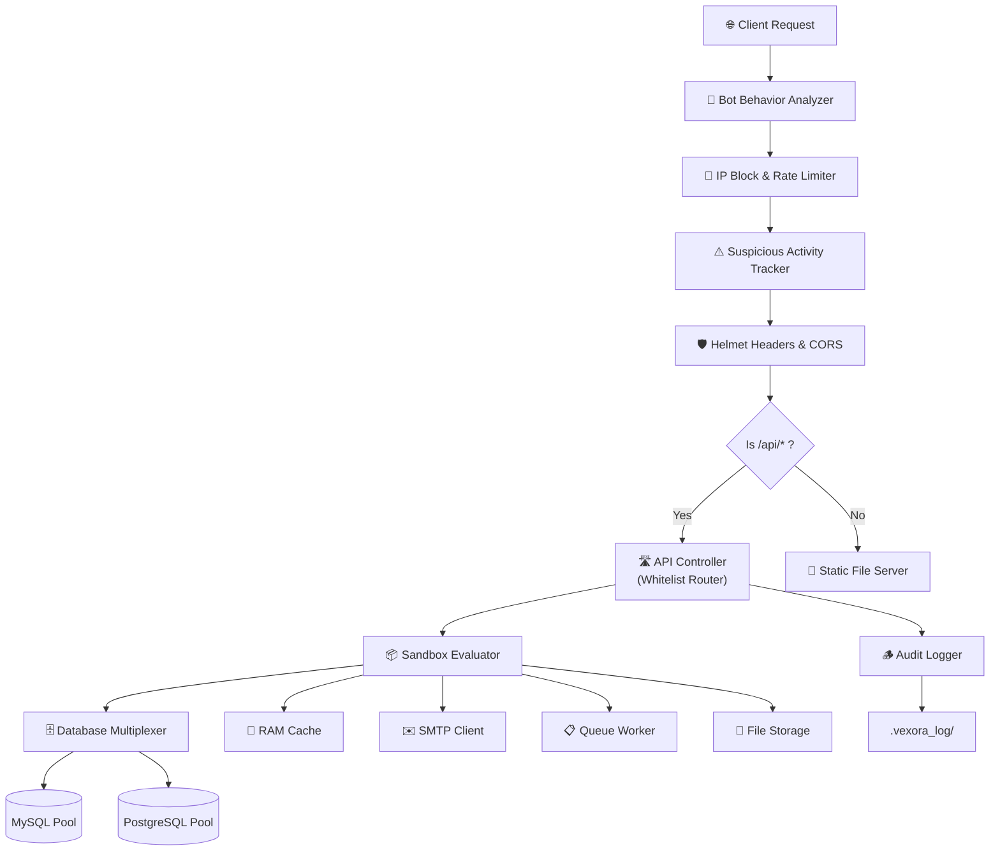

<p align="center">
  
</p>

<h1 align="center">⚡ Vexora Framework</h1>

<p align="center">
  <strong>The Backend Master — Enterprise-Grade, Blazing-Fast, Zero-Dependency Node.js Engine</strong>
</p>

<p align="center">
  <a href="https://www.npmjs.com/package/vexora"></a>
  <a href="https://opensource.org/licenses/MIT"></a>
  
  
  
</p>

<p align="center">
  Build high-performance REST APIs, real-time WebSockets, encrypted file storage, background job queues,<br/>
  and complex database-driven architectures — all without a single third-party dependency.
</p>

---

<details>
<summary><strong>📑 Table of Contents</strong> <em>(click to expand)</em></summary>

#### Getting Started
- [Installation](#installation)
- [CLI Tools](#cli-tools)
- [Quick Start](#quick-start)
- [Key Features](#key-features)
- [Framework Comparison](#framework-comparison)
- [Project Directory Structure](#project-structure)
- [Architecture & Request Lifecycle](#architecture)
- [Absolute Imports & Named Exports](#absolute-imports)

#### Core Systems
- [API Routing (Whitelisted)](#api-routing)
- [Sub-Router Auto-Discovery](#sub-routers)
- [Action Scripts (Controllers)](#action-scripts)
- [Standard Routing & Custom Controllers](#routing)
- [Serving Static Files & PHP-CGI](#static-files)
- [Custom Error Pages](#error-pages)
- [Database & CRUD](#database)

#### Security & Auth
- [CSRF Protection](#csrf-protection)
- [Token Vault](#token-vault)
- [CAPTCHA Verification](#captcha)
- [Bot Shield & Behavior Analyzer](#bot-shield)
- [IP Blocking](#ip-blocking)
- [Rate Limiting](#rate-limiting)
- [Suspicious Activity Throttling](#suspicious-throttling)

#### Built-in Engines
- [RAM Cache (Redis Mock)](#ram-cache)
- [WebSockets](#websockets)
- [SMTP Mail Client](#smtp-mail)
- [HTTP Client](#http-client)
- [Queue & Background Jobs](#queue-jobs)
- [Task Scheduler & Cron](#task-scheduler)
- [File Storage & Encryption](#file-upload)

#### API Reference
- [Cryptographic Helpers](#crypto-helpers)
- [Request & Response](#request-response)
- [Sessions](#sessions)
- [Input Validation](#validation)
- [Configuration Access](#config-access)

#### Meta
- [Full Configuration Reference](#config-reference)
- [License](#license)

</details>

---

<a id="installation"></a>

## 📦 Installation

```bash
npm install vexora
```

> [!NOTE]
> Vexora requires **Node.js v18.0.0** or higher. Database drivers (`mysql2`, `pg`) are included as optional peer dependencies and only loaded when a database connection is configured.

---

<a id="cli-tools"></a>

## 🛠️ CLI Tools & Security Analyzer

Run this command to open the interactive CLI helper tool:

```bash
npx vexora
# or
npx vexora init
```

### 🛡️ Master Live Security Scanner & Code Analyzer

Audit your entire codebase, configuration, ES module imports, hardcoded secrets, and syntax errors with a single command:

```bash
npx vexora security:scan
```

This runs a 5-step animated security scan:
1. ⚙️ **Master Configuration Audit** (`.vexora_config/config`, CORS, CSRF, DDoS Shield settings)
2. 🛡️ **HTTP Security Headers & Bot Analyzer Check**
3. ⚡ **Deep Static Code Analysis & ES Module Syntax Verification**
4. 🔑 **Hardcoded Secrets & Credential Leak Detection** (AWS keys, Passwords, RSA private keys)
5. 📌 **Whitelisted Router & API Endpoint Hardening Audit**

Produces an instant **Security Scorecard (e.g. `Score: 98/100 — GRADE A+`)** with exact line numbers and fix recommendations!

---

<a id="key-features"></a>

<details>
<summary><strong>✨ Key Features</strong> <em>(click to expand)</em></summary>

| Category | Feature | Description |
|:---------|:--------|:------------|
| 🏗️ **Core** | **Zero-Dependency Architecture** | Built 100% on Node.js native modules (`http`, `crypto`, `events`, `async_hooks`). Only optional DB drivers (`mysql2`, `pg`) for database connections. |
| ⚡ **Performance** | **~90,000 req/sec Throughput** | Shallow call stacks interfacing directly with TCP sockets outperform Express (~15K) and Fastify (~60K). |
| 🛡️ **Security** | **Master Live Security Scanner** | Built-in `npx vexora security:scan` static analyzer for ES module resolution, hardcoded secrets, and security scorecards. |
| 🧵 **Context** | **Thread-Safe Request Binding** | Native `AsyncLocalStorage` maps request/response/session globally across all files — zero parameter drilling. |
| 🔌 **Real-time** | **Native WebSocket Server** | Optimized TCP frame parser with binary mask/unmask built directly into the core stream layer. |
| 🗄️ **Database** | **Multi-Pool DB Routing** | Simultaneous MySQL + PostgreSQL pools with auto-escaping, entity quoting, pagination, and nested savepoints. |
| 💾 **Cache** | **Sub-μs RAM Cache** | In-memory TTL store with atomic counters, garbage collection, and strict RAM limit enforcement. |
| ✉️ **Mail** | **Native SMTP Client** | Raw TCP/TLS socket construction — SSL, STARTTLS, AUTH LOGIN, Base64 challenges, multipart payloads. |
| 🔒 **Security** | **Hardened by Default** | Timing-safe CSRF, Helmet headers, global rate limiting, bot jitter analysis, IP blocking, and auto-trimmed inputs. |
| 📁 **Storage** | **Encrypted File Uploads** | AES-256-CBC encryption, magic-byte MIME validation, device-bound upload tokens, and path traversal guards. |
| 🪵 **Logging** | **Silent Audit Trails** | Auto-masks passwords/tokens/CVVs, conceals server paths, issues UUID error trackers to clients. |
| 🤖 **Bot Shield** | **Behavioral Analysis** | Jitter timing analysis, headless browser detection, 404 route scanning guard — all automatic. |
| ⏰ **Scheduler** | **Built-in Cron Engine** | Standard 5-field cron expressions and interval-based scheduling with zero external dependencies. |
| 📋 **Queue** | **Background Job Worker** | Define, dispatch, and retry background jobs with configurable concurrency and failure handling. |

</details>

---

<a id="quick-start"></a>

## 🚀 Quick Start

### Step 1 — Create Your Server

```javascript
// index.js
import Vexora from "vexora";

// Start the Vexora server on port 3000
// This auto-connects API controllers, static serving, and security middleware
const app = Vexora.start(3000);
```

### Step 2 — Run

```bash
node index.js
```

```
⚡ Vexora Engine v1.0.4 Initialized in 1.82ms.
🚀 Vexora Server is running at http://localhost:3000
```

### Step 3 — Test

```bash
# API root endpoint
curl http://localhost:3000/api
```

```json
{ "status": true, "message": "Vexora API is running" }
```

> [!TIP]
> **First Boot**: When Vexora starts for the first time, it automatically creates a `.vexora_config/config` file and `.api_routes/` directory in your project root with all default configuration keys and a starter whitelist router. Edit these to customize your application.

> [!IMPORTANT]
> **Strict Route Segregation:**
> - **`/api/*`** requests → Processed by API Controllers (`.api_routes/`) and custom routes. Static files are **never** served.
> - **All other requests** → Served from the `public/` static directory only. Custom routes are **never** executed.
>
> This prevents accidental overlap between your API endpoints and static assets.

---

<a id="project-structure"></a>

## 📂 Project Directory Structure

When Vexora boots for the first time, it scaffolds the following project structure:

```
your-project/
├── .api_routes/                    # 🛣️  API Route Controllers (Auto-scanned)
│   ├── api.whitelist.js            #     Root-level whitelist router (/api/*)
│   ├── login.js                    #     Action script for /api/login
│   ├── admin/                      #     Sub-router directory (/api/admin/*)
│   │   ├── api.whitelist.js        #     Admin-specific whitelist router
│   │   └── get_data.js             #     Action script for /api/admin/get_data
│   └── user/                       #     Sub-router directory (/api/user/*)
│       ├── api.whitelist.js        #     User-specific whitelist router
│       └── profile.js              #     Action script for /api/user/profile
│
├── .vexora_config/                 # ⚙️  Framework Configuration
│   ├── config                      #     Master config file (ports, security, SMTP, etc.)
│   └── db_config.json              #     Multi-database connection pools
│
├── .vexora_error_page/             # 🎨 Custom Error Page Templates
│   ├── 404.html                    #     Route / File Not Found
│   ├── 403.html                    #     Blocked IPs / Security Denials
│   └── 500.html                    #     Runtime Internal Server Errors
│
├── .vexora_log/                    # 📋 Runtime Logs (Auto-generated)
│   ├── Fatal/                      #     Fatal crash logs (by date)
│   ├── Error/                      #     Application error logs
│   └── Warning/                    #     Warning logs
│
├── .vexora_info/                   # 📄 Server Configuration Examples
│   ├── apache_litespeed.htaccess.example
│   └── nginx-websocket.conf.example
│
├── public/                         # 📁 Static Assets (HTML, CSS, JS, images)
│   └── index.html                  #     Default homepage
│
├── storage/                        # 💾 File Upload Storage (Encrypted/Plain)
│
├── index.js                        # 🚀 Application Entry Point
├── package.json
└── node_modules/
```

> [!NOTE]
> **Auto-Scaffold**: All `.vexora_*` directories and `.api_routes/` are automatically created on first boot. You don't need to create them manually.

---

<a id="architecture"></a>

## ⚙️ Internal Architecture & Request Lifecycle



### How a Request is Processed (Step by Step)

| Step | Layer | Description |
|:-----|:------|:------------|
| **1** | **Bot Analyzer** | Checks User-Agent for known bots (`puppeteer`, `selenium`, `curl`, etc.), analyzes request timing jitter for automated patterns, and tracks consecutive 404s for vulnerability scanning. |
| **2** | **IP Block** | Compares client IP against the `BLOCKED_IPS` list in config. Rejected IPs get `403 Forbidden` instantly — no further processing. |
| **3** | **Suspicious Tracker** | Monitors per-IP request frequency within a sliding window. If threshold is exceeded, IP is auto-blocked in RAM cache for `AUTO_BLOCK_DURATION` seconds. |
| **4** | **CORS & Headers** | Injects security headers (`X-Content-Type-Options`, `X-Frame-Options`, `Strict-Transport-Security`, etc.) and handles CORS preflight `OPTIONS` requests. |
| **5** | **Route Decision** | If URL starts with `/api` → API Controller. Otherwise → Static file server. **They never overlap.** |
| **6** | **API Controller** | Scans `.api_routes/` for matching `api.whitelist.js`, resolves the whitelisted action script, and executes it in a sandboxed context with pre-injected variables (`Vexora`, `req`, `res`, `db`, `params`). |
| **7** | **Static Server** | Stream-based file serving with MIME detection, caching headers, directory index resolution, path traversal blocking, and optional PHP-CGI execution. |
| **8** | **Audit Logger** | All errors are silently logged with UUID trackers to `.vexora_log/`. Passwords, tokens, and CVVs are auto-masked. Server paths are never leaked to clients. |

### Key Architectural Concepts

| Concept | Description |
|:--------|:------------|
| **AsyncLocalStorage Context** | Node's native `AsyncLocalStorage` isolates each request into its own storage cell. Methods like `Vexora.Request.input()` access this cell globally — no `req`/`res` parameter drilling needed. |
| **Sandbox Evaluator** | Route autoloader compiles controller scripts using `new AsyncFunction('Vexora', 'req', 'res', 'db', 'params', code)`. Variables are pre-injected. Compiled functions are cached in-memory for **~100x faster** subsequent execution. |
| **Database Multiplexer** | Connections are lazy-loaded and cached in a global pool map. Table/column identifiers are validated against strict regexes and wrapped in engine-specific quotes (`` ` `` for MySQL, `"` for PostgreSQL). |
| **Immutable Export** | The `Vexora` object is wrapped in a `Proxy` that prevents any runtime mutation (`set`, `defineProperty`, `deleteProperty`, `setPrototypeOf`). This guarantees framework integrity even in adversarial plugin environments. |

---

<a id="api-routing"></a>

## 🗂️ Secure API Routing (Whitelist System)

Vexora uses a **strictly whitelisted** routing system. When the server boots, it scans the `.api_routes/` directory and loads the `api.whitelist.js` file as the root router. **If a route is not whitelisted, it returns a 404 — the file is never executed.**

### How It Works

```
Request: GET /api/login
         │
         ▼
┌─── .api_routes/api.whitelist.js ───┐
│  apiRouter.post('login');          │  ← Is 'login' whitelisted? ✅
│  → Executes .api_routes/login.js   │
└────────────────────────────────────┘

Request: GET /api/admin/get_data
         │
         ▼
┌─── .api_routes/admin/api.whitelist.js ───┐
│  apiRouter.any('get_data');              │  ← Is 'get_data' whitelisted? ✅
│  → Executes .api_routes/admin/get_data.js │
└──────────────────────────────────────────┘

Request: GET /api/secret
         │
         ▼
┌─── .api_routes/api.whitelist.js ───┐
│  'secret' is NOT whitelisted       │  ← ❌ Returns 404
└────────────────────────────────────┘
```

### The Whitelist Router (`api.whitelist.js`)

```javascript
// .api_routes/api.whitelist.js
import Vexora from "vexora";
const apiRouter = new Vexora.RouteController();

// Map URL → File (auto-matches URL segment to filename)
// POST http://localhost:3000/api/login → .api_routes/login.js
apiRouter.post('login');

// ANY http://localhost:3000/api/register → .api_routes/register.js
apiRouter.any('register');

// GET http://localhost:3000/api/status → .api_routes/status.js
apiRouter.get('status');

// Multiple methods for one route
apiRouter.match(['GET', 'POST'], 'profile');

// Inline handler (no file needed)
apiRouter.any('health', (req, res) => {
    return res.json({ status: true, uptime: process.uptime() });
});

// Catch-all for unmatched routes (optional)
apiRouter.any('/:any', (req, res) => {
    return res.json({ status: false, message: "Action not found!" }, 404);
});

export default apiRouter;
```

### Available Router Methods

| Method | HTTP Verb(s) | Example |
|:-------|:-------------|:--------|
| `apiRouter.get(uri, action?)` | `GET` | `apiRouter.get('users')` |
| `apiRouter.post(uri, action?)` | `POST` | `apiRouter.post('login')` |
| `apiRouter.put(uri, action?)` | `PUT` | `apiRouter.put('update')` |
| `apiRouter.patch(uri, action?)` | `PATCH` | `apiRouter.patch('edit')` |
| `apiRouter.delete(uri, action?)` | `DELETE` | `apiRouter.delete('remove')` |
| `apiRouter.any(uri, action?)` | `ALL` | `apiRouter.any('dashboard')` |
| `apiRouter.match(methods, uri, action?)` | Custom | `apiRouter.match(['GET','POST'], 'data')` |

> [!TIP]
> When `action` is omitted, Vexora automatically maps the URI segment to a `.js` file with the same name. So `apiRouter.post('login')` automatically executes `.api_routes/login.js`.

### Per-Route Rate Limiting

```javascript
// Limit /api/login to 5 requests per 60 seconds per IP
apiRouter.post('login').rateLimit(60, 5);

// Limit /api/search to 30 requests per 60 seconds per IP
apiRouter.get('search').rateLimit(60, 30);
```

---

<a id="sub-routers"></a>

## 🌳 Sub-Router Auto-Discovery (Infinite Nesting)

Vexora automatically scans subdirectories inside `.api_routes/` for their own `api.whitelist.js` files. You never need to manually register sub-routers — just create a folder and a whitelist file.

### How Sub-Routing Works

```
.api_routes/
├── api.whitelist.js          ← Handles /api/*
├── admin/
│   ├── api.whitelist.js      ← Handles /api/admin/*  (auto-discovered!)
│   └── get_data.js
├── user/
│   ├── api.whitelist.js      ← Handles /api/user/*   (auto-discovered!)
│   └── profile.js
└── admin/v1/
    ├── api.whitelist.js      ← Handles /api/admin/v1/* (infinite nesting!)
    └── reports.js
```

### URL Resolution Rules

| URL | Resolves To |
|:----|:------------|
| `GET /api` or `GET /api/` | Returns `{"status": true, "message": "Vexora API is running"}` |
| `GET /api/login` | Root whitelist → `.api_routes/login.js` |
| `GET /api/admin` (no trailing `/`) | Root whitelist → checks for `admin` route in root `api.whitelist.js` |
| `GET /api/admin/` (trailing `/`) | Sub-router → `.api_routes/admin/api.whitelist.js` takes over |
| `GET /api/admin/get_data` | Sub-router → `.api_routes/admin/get_data.js` |
| `GET /api/admin/v1/reports` | Deep sub-router → `.api_routes/admin/v1/reports.js` |
| `GET /api/nonexistent` | Returns `{"status": false, "message": "API Route Not Found"}` |
| `GET /api/admin/nonexistent` | Returns `{"status": false, "message": "Invalid endpoint"}` |

> [!IMPORTANT]
> **Trailing Slash Matters:**
> - `/api/admin` (no slash) → Resolved in **root** whitelist
> - `/api/admin/` (with slash) → Resolved in **admin subfolder** whitelist
> - `/api/admin/action` → Resolved in **admin subfolder** whitelist

### Error Response Logic

| Scenario | Response |
|:---------|:---------|
| Sub-router folder **does not exist** | `"API Route Not Found"` (404) |
| Sub-router folder **exists** but endpoint is not whitelisted | `"Invalid endpoint"` (404) |
| Route exists but wrong HTTP method | `"Method Not Allowed"` (405) |

---

<a id="action-scripts"></a>

## 📝 Action Scripts (Controllers)

Action scripts are the handler files that get executed when a whitelisted route is matched. They run in a **sandboxed context** with pre-injected variables — **no imports needed!**

### Pre-Injected Variables

| Variable | Type | Description |
|:---------|:-----|:------------|
| `Vexora` | Object | Full framework API (Database, Cache, Response, Helper, etc.) |
| `req` | Object | Request object (body, query, headers, method, path, ip, etc.) |
| `res` | Object | Response object (json, success, error, redirect, etc.) |
| `db` | Object | Database helper (shortcut to `Vexora.db`) |
| `params` | Object | URL path parameters (e.g., `/:id` → `params.id`) |

### Example Action Script

```javascript
// .api_routes/login.js
// ⚠️ No imports needed! Vexora, req, res, db, params are pre-injected.

const username = req.body.username;
const password = req.body.password;

// Query the database
const user = await Vexora.fetch("auth", "SELECT * FROM users WHERE username = ?", [username]);

if (!user) {
    Vexora.Response.error("User not found!", 404);
} else if (!Vexora.Helper.verifyPassword(password, user.password)) {
    Vexora.Response.error("Invalid credentials!", 401);
} else {
    // Set session
    Vexora.ss.set("user_id", user.id);
    Vexora.ss.set("role", user.role);

    Vexora.Response.success({
        id: user.id,
        username: user.username,
        role: user.role
    }, "Login successful!");
}
```

### ES Module Action Script (Alternative)

If you prefer standard ES module syntax with explicit imports:

```javascript
// .api_routes/admin/dashboard.js
import Vexora from "vexora";

export default async function handler(req, res) {
    const stats = {
        totalUsers: await Vexora.count("auth", "users"),
        activeUsers: await Vexora.count("auth", "users", "status = ?", ["active"]),
        uptime: process.uptime()
    };
    return res.success(stats, "Dashboard loaded!");
}
```

---

<a id="routing"></a>

## 🛣️ Standard Routing & Custom Controllers

Beyond the whitelist-based API routing, you can define custom routes directly on the `app` object returned by `Vexora.start()`:

### Define Custom Routes

```javascript
import Vexora from "vexora";

const app = Vexora.start(3000);

// All custom routes are auto-prefixed with /api
// app.get("/hello", ...) → actually handles GET /api/hello

app.get("/hello", (req, res) => {
    return res.success({ greeting: "Hello World!" });
});

app.post("/submit", async (req, res) => {
    const data = req.body;
    const id = await Vexora.insert("auth", "submissions", data);
    return res.success({ id }, "Submitted!");
});

// Multiple methods
app.match(["GET", "POST"], "/form", (req, res) => {
    return res.json({ status: true, method: req.method });
});

// Any HTTP method
app.any("/wildcard", (req, res) => {
    return res.success(null, "Matches any method!");
});
```

### Unique Vexora Routing Syntax

```javascript
// Vexora-style routing: app.Vexora(method, uri, handler)
app.Vexora("GET", "/info", (req, res) => {
    return res.success({ version: "1.3.8" });
});

app.Vexora("POST", "/data", async (req, res) => {
    return res.success(req.body, "Received!");
});

app.Vexora("ANY", "/ping", (req, res) => {
    return res.json({ pong: true });
});
```

> [!IMPORTANT]
> **Route Priority (highest to lowest):**
> 1. **API Controllers** (`.api_routes/api.whitelist.js`) — Checked first for `/api/*` requests
> 2. **Custom Routes** (`app.get()`, `app.post()`, etc.) — Fallback for unhandled `/api/*` requests
> 3. **Static Files** (`public/`) — Only for non-`/api` requests

### Route Access Protection

```javascript
// Inside any action script file:
// Blocks ALL external HTTP access (GET, POST, Fetch, Axios, URL) to this route
// The file can only be imported internally as a server-side module
Vexora.protect();
```

### Emergency Server Lockdown

To block **all** incoming traffic globally:

```ini
# .vexora_config/config
EMERGENCY_BLOCK=true
```

---

<a id="static-files"></a>

## 📁 Serving Static Files & PHP-CGI

Vexora includes a native, stream-based static asset server with caching headers, traversal protection, rate limiting, and PHP-CGI execution:

### Configuration

```javascript
import Vexora from "vexora";

const app = Vexora.start(3000);

// Configure static file serving
app.static("public", "home.html", {
    maxAge: 86400,          // Cache duration in seconds (default: 1 day)
    rateLimit: {
        maxRequests: 150,   // Max requests per window per IP
        windowSeconds: 60   // Window duration in seconds
    }
});
```

### Static Serving Parameters

| Parameter | Type | Default | Description |
|:----------|:-----|:--------|:------------|
| `staticDir` | String | `"public"` | Directory to serve files from (relative to project root) |
| `defaultIndex` | String | `"index.html"` | Default file to serve when a directory is requested |
| `options.maxAge` | Number | `86400` | Cache-Control max-age in seconds |
| `options.rateLimit` | Object | `null` | Per-IP rate limiting for static assets |

### Features

| Feature | Description |
|:--------|:------------|
| **Stream-Based** | Uses `fs.createReadStream()` for memory-efficient large file serving |
| **MIME Detection** | Auto-detects content types for 20+ file extensions |
| **Cache Headers** | Sends `Cache-Control: public, max-age=N` for performance |
| **Directory Traversal Guard** | Blocks `../` path escape attempts |
| **Hidden File Protection** | Auto-blocks `.git/`, `.vexora_config/`, `node_modules/`, `package.json`, etc. |
| **PHP-CGI Execution** | `.php` files and `.html`/`.htm` files containing `<?php` tags are auto-executed via `php-cgi` |
| **Rate Limiting** | Optional per-IP rate limiting on static asset requests |

### PHP-CGI Support

Vexora automatically detects and executes PHP files through `php-cgi`:

```
public/
├── index.html          ← Served as static HTML
├── contact.php         ← Executed via php-cgi, output streamed to client
└── dynamic.html        ← If contains <?php tags, executed via php-cgi
```

> [!NOTE]
> PHP-CGI support requires `php-cgi` to be installed and available in your system PATH. CGI environment variables (`SCRIPT_FILENAME`, `REQUEST_URI`, `QUERY_STRING`, etc.) are automatically set.

---

<a id="error-pages"></a>

## 🎨 Custom Error Pages

Place HTML files in the `.vexora_error_page/` directory for custom error pages. When a browser requests a missing page (with `Accept: text/html`), Vexora serves your custom HTML template instead of a JSON error.

| File | Trigger | Default Response |
|:-----|:--------|:-----------------|
| `.vexora_error_page/404.html` | Route / File Not Found | JSON `{"status": false, "message": "..."}` |
| `.vexora_error_page/403.html` | Blocked IPs / Security Denials | JSON `{"status": false, "message": "Forbidden"}` |
| `.vexora_error_page/500.html` | Runtime Internal Server Errors | JSON `{"status": false, "message": "..."}` |

> [!TIP]
> Custom error pages are only served to **browser requests** (those with `Accept: text/html` header). API clients (Postman, Axios, `curl`) continue to receive structured JSON responses.

---

<a id="database"></a>

## 🗄️ Multi-Connection Database Routing & CRUD

### Database Configuration

Configure connection pools in `.vexora_config/db_config.json`:

```json
{
  "auth": {
    "DB_HOST": "127.0.0.1",
    "DB_NAME": "auth_database",
    "DB_USER": "root",
    "DB_PASS": "secure_password",
    "DB_DRIVER": "mysql"
  },
  "analytics": {
    "DB_HOST": "10.0.0.5",
    "DB_NAME": "analytics_db",
    "DB_USER": "analytics_user",
    "DB_PASS": "analytics_pass",
    "DB_DRIVER": "pg"
  }
}
```

> [!IMPORTANT]
> Pass the configuration key (e.g., `"auth"`, `"analytics"`) as the first parameter to any database method. If omitted, Vexora uses the **first pool** defined in `db_config.json`.

### Fetching Data

```javascript
// Fetch a single row (returns object or null)
const user = await Vexora.fetch("auth", "SELECT * FROM users WHERE id = ?", [1]);

// Fetch all matching rows (returns array)
const users = await Vexora.fetchAll("auth", "SELECT * FROM users WHERE status = ?", ["active"]);

// Fetch a single column value directly
const balance = await Vexora.fetchColumn("auth", "SELECT balance FROM users WHERE id = ?", [1]);

// Raw query (returns full result set)
const rows = await Vexora.query("auth", "SELECT * FROM logs");

// Execute DDL/non-select statements
await Vexora.exec("auth", "CREATE TABLE IF NOT EXISTS ...");
```

### CRUD Helpers

All table and column identifiers are auto-sanitized and quoted (`` ` `` for MySQL, `"` for PostgreSQL) to block SQL injection at the schema level.

```javascript
// INSERT — returns auto-increment primary key ID
const userId = await Vexora.insert("auth", "users", {
    email: "john@example.com",
    username: "john_doe",
    status: "active"
});

// UPDATE — returns affected rows count
const affected = await Vexora.update(
    "auth", "users",
    { status: "suspended" },
    "id = ?", [userId]
);

// DELETE
await Vexora.delete("auth", "users", "id = ?", [userId]);

// UPSERT — Insert or update if exists
await Vexora.upsert("auth", "users", {
    email: "john@example.com",
    username: "john_updated"
});

// EXISTS — returns boolean
const exists = await Vexora.exists("auth", "users", "email = ?", ["test@email.com"]);

// COUNT — returns number
const total = await Vexora.count("auth", "users", "status = ?", ["active"]);
```

### Pagination

```javascript
const page = await Vexora.paginate(
    "auth",
    "SELECT * FROM users WHERE status = ?",
    ["active"],
    1,   // Page number
    10   // Items per page
);

console.log(page.items);         // Array of rows
console.log(page.total_items);   // Total matching records
console.log(page.total_pages);   // Calculated page count
console.log(page.has_next);      // true / false
```

### Nested Savepoint Transactions

```javascript
await Vexora.begin("auth");
try {
    await Vexora.insert("auth", "logs", { log_type: "parent" });

    await Vexora.begin("auth"); // Nested savepoint
    try {
        await Vexora.update("auth", "users", { balance: 100 }, "id = ?", [1]);
        await Vexora.commit("auth"); // Release inner savepoint
    } catch (innerErr) {
        await Vexora.rollback("auth"); // Rollback to outer savepoint
    }

    await Vexora.commit("auth"); // Commit all
} catch (err) {
    await Vexora.rollback("auth"); // Rollback entire transaction
}
```

### Complete Database API

| Method | Returns | Description |
|:-------|:--------|:------------|
| `Vexora.fetch(pool, sql, params)` | Object \| null | Single row |
| `Vexora.fetchAll(pool, sql, params)` | Array | All matching rows |
| `Vexora.fetchColumn(pool, sql, params)` | Any | Single column value |
| `Vexora.query(pool, sql, params)` | Array | Full result set |
| `Vexora.exec(pool, sql, params)` | Result | Execute statement |
| `Vexora.insert(pool, table, data)` | Number | Auto-increment ID |
| `Vexora.update(pool, table, data, where, params)` | Number | Affected rows |
| `Vexora.delete(pool, table, where, params)` | Result | Delete rows |
| `Vexora.upsert(pool, table, data)` | Result | Insert or update |
| `Vexora.exists(pool, table, where, params)` | Boolean | Row exists? |
| `Vexora.count(pool, table, where, params)` | Number | Row count |
| `Vexora.paginate(pool, sql, params, page, perPage)` | Object | Paginated result |
| `Vexora.begin(pool)` | void | Start transaction/savepoint |
| `Vexora.commit(pool)` | void | Commit transaction/savepoint |
| `Vexora.rollback(pool)` | void | Rollback transaction/savepoint |

---

<a id="csrf-protection"></a>

## 🛡️ CSRF Protection

Timing-safe, device-bound, session-bound CSRF token system:

```javascript
import Vexora from "vexora";

// Generate a device-bound CSRF token
const csrfToken = Vexora.csrf.generate({
    bindDevice: true,   // Bind to User-Agent
    bindIp: true,       // Bind to client IP
    bindSession: true,  // Bind to active session
    maxUses: 1,         // Single-use (token rotation)
    ttl: "1H"
});

// Verify — Option A: Sealed TokenVault CSRF token
if (Vexora.csrf.verify(req.headers["x-csrf-token"])) {
    console.log("✅ CSRF Verified!");
}

// Verify — Option B: Constant-time direct comparison
if (Vexora.csrf.verify(clientToken, serverSessionToken)) {
    console.log("✅ Token matches!");
}
```

---

<a id="token-vault"></a>

## 🗝️ Token Vault

Cryptographically-hardened payload sealing using HKDF key derivation + AES-256-GCM encryption with optional environment bindings:

### Configure

```javascript
Vexora.TokenVault.configure(
    { key_v1: "master-key-secret-must-be-at-least-16-chars" },
    "my-app-issuer",
    "my-app-audience"
);
```

### Seal (Create Token)

```javascript
const result = Vexora.TokenVault.seal(
    { userId: 42, role: "admin" },  // Payload
    "user-unique-secret",            // User key (HKDF derivation)
    "1H",                            // Duration: "30M", "1H", "2D"
    "auth",                          // Purpose
    0,                               // nbfOffset (Not Before)
    false,                           // bindSession
    true,                            // bindIp
    true,                            // bindDevice
    1                                // maxUses (0 = unlimited)
);

if (result.status) {
    console.log("Token:", result.token);   // "key_v1.ciphertext"
    console.log("JTI:", result.jti);       // UUID for tracking
    console.log("Expires:", result.exp);   // UNIX timestamp
}
```

### Unseal (Verify & Decrypt)

```javascript
const result = Vexora.TokenVault.unseal(token, "user-unique-secret", "auth");

if (result.status) {
    console.log("Data:", result.data);     // { userId: 42, role: "admin" }
    console.log("Claims:", result.claims); // iss, aud, iat, exp, etc.
} else {
    console.error("Failed:", result.error);
    // "Token expired", "IP binding failed", "Purpose mismatch"
}
```

---

<a id="crypto-helpers"></a>

## 🔐 Cryptographic Helpers

```javascript
// Scrypt password hashing & timing-safe verification
const hashed  = Vexora.Helper.hashPassword("my_secret_pass");
const isValid = Vexora.Helper.verifyPassword("my_secret_pass", hashed);

// AES-256-GCM authenticated encryption (uses AES_SECRET from config)
const encrypted = Vexora.Helper.encrypt("sensitive information");
const decrypted = Vexora.Helper.decrypt(encrypted);

// Secure random generation
const token = Vexora.Helper.randomToken(32);           // Hex token
const otp   = Vexora.Helper.randomInt(100000, 999999); // Secure OTP
const uuid  = Vexora.Helper.uuid();                    // UUID v4

// Client IP detection (Cloudflare / reverse proxy aware)
const ip = Vexora.Helper.getClientIp(req);
```

---

<a id="websockets"></a>

## 🔌 WebSockets

Zero-dependency native WebSocket engine built directly over TCP stream layers:

### Server Setup

```javascript
import Vexora from "vexora";

const app = Vexora.start(3000);

// Bind WebSocket engine to the HTTP server
const io = Vexora.WebSocket(app);
console.log("🌐 Vexora WebSocket Engine is running!");

io.on("connection", (socket) => {
    console.log("🔌 Client connected!");

    // Send to this client
    socket.send({ type: "welcome", message: "Connected to Vexora!" });

    // Listen for messages
    socket.on("message", (msg) => {
        console.log("Received:", msg);

        // Broadcast to all OTHER clients (excluding sender)
        socket.broadcast(msg);

        // Broadcast to EVERYONE (including sender)
        // io.broadcast(msg);
    });

    socket.on("disconnect", () => {
        console.log("🔌 Client disconnected");
    });
});
```

### WebSocket API

| Method | Description |
|:-------|:------------|
| `Vexora.WebSocket(app)` | Bind WebSocket engine to HTTP server, returns `io` instance |
| `io.on("connection", callback)` | Listen for new WebSocket connections |
| `socket.send(data)` | Send data to this specific client |
| `socket.broadcast(data)` | Send to all connected clients **except** sender |
| `io.broadcast(data)` | Send to **all** connected clients including sender |
| `socket.on("message", callback)` | Listen for incoming messages from this client |
| `socket.on("disconnect", callback)` | Listen for client disconnection |

### Reverse Proxy Setup (Hostinger / Nginx)

**For LiteSpeed / Apache (Hostinger Shared/Cloud):**
```apache
<IfModule mod_rewrite.c>
    RewriteEngine On
    RewriteCond %{HTTP:Upgrade} =websocket [NC]
    RewriteRule /(.*)           ws://127.0.0.1:3000/$1 [P,L]
</IfModule>
```

**For Nginx (VPS / Dedicated):**
```nginx
location / {
    proxy_pass http://127.0.0.1:3000;
    proxy_http_version 1.1;
    proxy_set_header Upgrade $http_upgrade;
    proxy_set_header Connection "Upgrade";
    proxy_set_header Host $host;
    proxy_cache_bypass $http_upgrade;
}
```

> [!TIP]
> Vexora auto-generates example proxy configuration files in `.vexora_info/` on first boot.

### Client Setup

```html
<script>
    const ws = new WebSocket("ws://localhost:3000");

    ws.onopen = () => console.log("Connected!");
    ws.onmessage = (e) => console.log("Received:", JSON.parse(e.data));
    ws.onclose = () => console.log("Disconnected!");

    // Send message
    ws.send("Hello Vexora!");
</script>
```

---

<a id="request-response"></a>

## 🧵 Request & Response

### Global Request Context

```javascript
// Get all inputs combined (Query + Body) — auto-trimmed
const inputs = Vexora.Request.all();

// Get specific parameter with fallback default
const age = Vexora.Request.input("age", 18);

// Get real client IP (Cloudflare / proxy headers matched)
const clientIp = Vexora.Request.ip();
```

### Request Object Properties (inside action scripts)

| Property | Type | Description |
|:---------|:-----|:------------|
| `req.body` | Object | Parsed request body (JSON, form-data) |
| `req.query` | Object | URL query parameters |
| `req.params` | Object | URL path parameters |
| `req.headers` | Object | Request headers (lowercase keys) |
| `req.method` | String | HTTP method (`GET`, `POST`, etc.) |
| `req.path` | String | URL path without query string |
| `req.url` | String | Full URL with query string |
| `req.ip` | String | Client IP address |
| `req.file` | Object | Uploaded file (if multipart) |
| `req.session` | Object | Session data store |

### Response Engine

```javascript
// Success — HTTP 200
// Output: { "status": true, "message": "...", "data": {...}, "execution_time": "1.24ms" }
Vexora.Response.success({ id: 1, name: "Satyam" }, "Profile loaded!");

// Error — HTTP 401
// Output: { "status": false, "message": "...", "data": null, "execution_time": "0.85ms" }
Vexora.Response.error("Invalid password!", 401);

// Custom JSON with specific HTTP code
Vexora.Response.json(true, "Custom message", { score: 99 }, 202);
```

### Response Object Methods (inside action scripts)

| Method | Description |
|:-------|:------------|
| `res.json(data, statusCode?)` | Send JSON response |
| `res.success(data, message?)` | Send success JSON (HTTP 200) |
| `res.error(message, statusCode?)` | Send error JSON |
| `res.redirect(url, statusCode?)` | HTTP redirect |
| `res.cookie(name, value, options)` | Set cookie |

---

<a id="ram-cache"></a>

## 💾 RAM Cache (Redis Mock)

Sub-microsecond in-memory key-value store with TTL eviction, atomic counters, and RAM limit enforcement.

### Configuration

```ini
# .vexora_config/config
REDIS_DATABASE_SIZE=500MB
```

> [!NOTE]
> Supported size units: `B`, `KB`, `MB`, `GB` (e.g., `500MB`, `1GB`, `10KB`).

### Usage

```javascript
// Set persistent key
Vexora.Redis.set("username", "satyam_kumar");

// Set key with TTL (expires in 60 seconds)
Vexora.Redis.set("temp_token", { auth: true }, 60);

// Get key (returns null if expired/missing)
const token = Vexora.Redis.get("temp_token", null);

// Check existence
const exists = Vexora.Redis.has("temp_token");

// Delete key
Vexora.Redis.del("temp_token");
```

### User-Scoped Caching

Automatically scopes keys to specific users to prevent overlapping data:

```javascript
// Set user-specific data → stored as "user:101:username"
Vexora.Redis.user(101).set("username", "satyam_kumar");

// Retrieve user-specific data
const name = Vexora.Redis.user(101).get("username");

// Delete & check
Vexora.Redis.user(101).del("username");
Vexora.Redis.user(101).has("username");
```

### Atomic Counters

```javascript
Vexora.Redis.set("counter", 10);

const inc = Vexora.Redis.incr("counter", 1);  // → 11
const dec = Vexora.Redis.decr("counter", 2);  // → 9
```

### Storage Diagnostics

```javascript
const stats = Vexora.info_redis();
```

```json
{
  "status": "connected",
  "total_keys": 4,
  "persistent_keys": 3,
  "ttl_keys": 1,
  "used_memory_bytes": 1056,
  "used_memory_human": "1.03 KB",
  "max_memory_bytes": 524288000,
  "max_memory_human": "500MB",
  "memory_usage_percentage": "0.00%",
  "keys": ["username", "counter", "large_data"]
}
```

---

<a id="sessions"></a>

## 🪟 Sessions

In-memory session management with TTL controls and session fixation protection:

```javascript
// Set & Get session variables
Vexora.ss.set("user_role", "admin");
const role = Vexora.ss.get("user_role");

// Remove session variable
Vexora.ss.unset("user_role");

// Reset all session data
Vexora.ss.reset();

// Session metadata
const info = Vexora.ss.info();
// → { id, lifetime, createdAt, lastAccessed, expiresInSeconds }

// Regenerate session ID (prevents session fixation attacks)
Vexora.ss.regenerate();
```

---

<a id="validation"></a>

## 🛡️ Input Validation

```javascript
const validator = Vexora.Validator.make(Vexora.Request.all(), {
    username: "required|string|min:4",
    email: "required|email",
    age: "required|integer|min:18"
});

if (validator.fails()) {
    return Vexora.Response.error("Validation Failed", 422, validator.getErrors());
}
```

---

<a id="smtp-mail"></a>

## ✉️ SMTP Mail Client

Zero-dependency native SMTP client over raw TCP/TLS sockets:

### Configuration

```ini
# .vexora_config/config
SMTP_HOST=smtp.hostinger.com
SMTP_PORT=465
SMTP_SECURE=ssl
SMTP_USER=no_reply@eformx.in
SMTP_PASS=your_password
FROM_NAME=eFormX
FROM_EMAIL=no_reply@eformx.in
```

### Send Email

```javascript
import Vexora from "vexora";

try {
    const response = await Vexora.mail.send({
        to: "client@example.com",
        subject: "Welcome to Vexora!",
        text: "Your account has been created.",
        html: "<h1>Welcome!</h1><p>Your account is ready.</p>"
    });

    if (response.success) {
        console.log("✅ Email sent!");
        console.log("SMTP Logs:", response.log);
    }
} catch (error) {
    console.error("❌ Failed:", error.message);
}
```

### Dynamic Credentials (Multi-Tenancy)

```javascript
await Vexora.mail.send({
    host: "custom-smtp.server.com",
    port: 587,
    secure: true,
    user: "tenant-auth",
    pass: "tenant-pass",
    from: "custom@tenant.com",
    to: "client@example.com",
    subject: "Tenant Email",
    text: "Hello from tenant!"
});
```

---

<a id="http-client"></a>

## 🌐 HTTP Client

Native lightweight HTTP/HTTPS request wrapper:

```javascript
import Vexora from "vexora";

// POST request with body and headers
const response = await Vexora.http.post(
    "https://api.example.com/users",
    { name: "Satyam Kumar", role: "developer" },
    { headers: { "Authorization": "Bearer YOUR_TOKEN" } }
);

if (response.ok) {
    console.log("Data:", response.data);
} else {
    console.log("Error:", response.status);
}

// GET request with query parameters
const search = await Vexora.http.get("https://api.example.com/search", {
    query: { q: "vexora", page: 1 },
    headers: { "Accept": "application/json" }
});

// PUT, PATCH, DELETE also available
const del = await Vexora.http.delete("https://api.example.com/users/1", {
    headers: { "Authorization": "Bearer token" }
});
```

---

<a id="ip-blocking"></a>

## 🚫 IP Blocking

Zero-overhead IP blocking at the start of the server lifecycle:

```ini
# .vexora_config/config
BLOCKED_IPS=192.168.1.50,10.0.0.99,8.8.8.8
```

Blocked IPs are rejected immediately with `403 Forbidden` — no routing, database, or session logic is executed.

---

<a id="suspicious-throttling"></a>

## ⚠️ Suspicious Activity Throttling

Automatic per-IP rate monitoring with temporary auto-blocking:

```ini
# .vexora_config/config
SUSPICIOUS_WINDOW=60        # Time window in seconds (default: 60)
SUSPICIOUS_THRESHOLD=30     # Max requests before blocking (default: 30)
AUTO_BLOCK_DURATION=300     # Block duration in seconds (default: 300)
```

**Behavior:**
- **Normal** (< threshold): Requests proceed normally
- **Abusive** (≥ threshold): IP auto-blocked in RAM Cache for `AUTO_BLOCK_DURATION` seconds → `403 Forbidden`
- **After expiry**: IP automatically unblocked

> [!NOTE]
> The suspicious tracker uses a memory-bounded map (max 100,000 entries). Under extreme DDoS conditions, the entire tracker is flushed as an emergency measure to prevent memory exhaustion.

---

<a id="rate-limiting"></a>

## ⏳ Custom Rate Limiters

Independent rate limiters for different resources:

```javascript
// Create a rate limiter: 30 requests per 60 seconds
const apiLimiter = new Vexora.RateLimiterClass({
    isEnabled: true,
    maxRequests: 30,
    windowSeconds: 60
});

// Check in your handler
const check = apiLimiter.check(req);
if (!check.allowed) {
    res.statusCode = 429;
    return res.json({
        status: false,
        message: `Too many requests. Retry after ${check.retryAfter}s.`
    });
}
```

---

<a id="bot-shield"></a>

## 🤖 Bot Behavior Analyzer

State-of-the-art behavioral guard that distinguishes humans from automated scripts:

### Configuration

```ini
# .vexora_config/config
DETECT_BOT_BEHAVIOR=true    # Enable/disable (default: true)
BOT_MIN_JITTER=15           # Min interval jitter in ms (default: 15)
MAX_CONSECUTIVE_404S=15     # Max 404s before blocking (default: 15)
```

### Protection Layers

| Layer | Description |
|:------|:------------|
| **Jitter Analysis** | Tracks time intervals between requests. If standard deviation < `BOT_MIN_JITTER` over 6+ requests, detects bot loop and blocks IP. |
| **User-Agent Filter** | Blocks `puppeteer`, `playwright`, `selenium`, `headlesschrome`, `curl`, `wget`, `python-requests` on first request. |
| **Route Scanner Guard** | Tracks consecutive `404` responses. After `MAX_CONSECUTIVE_404S` failures, flags as vulnerability scanner and blocks IP. |

---

<a id="captcha"></a>

## 🛡️ CAPTCHA Verification

Native verification for Google reCAPTCHA and Cloudflare Turnstile:

### Configuration

```ini
# .vexora_config/config
CAPTCHA_PROVIDER=google     # 'google' or 'turnstile'
RECAPTCHA_SECRET=YOUR_SECRET_KEY
```

### Direct Verification

```javascript
const result = await Vexora.verifyCaptcha(req.body.captcha_token);

if (result.success) {
    console.log("Score (v3):", result.score);
} else {
    console.log("Failed:", result.errorCodes);
}
```

### Middleware

```javascript
const captchaGuard = Vexora.captcha({
    tokenField: "captcha_token",
    headerName: "x-captcha-token"
});

const app = Vexora.start(3000);

app.post("/secure-endpoint", async (req, res) => {
    const blocked = await captchaGuard(req, res);
    if (blocked) return;

    return res.success(null, "Access granted!");
});
```

---

<a id="queue-jobs"></a>

## 🗂️ Queue & Background Jobs

Native concurrent queue and background worker system:

### Configuration

```ini
# .vexora_config/config
QUEUE_DRIVER=memory          # 'memory' or 'cache' (persistent)
QUEUE_AUTO_START=true        # Auto-start worker on boot
QUEUE_CONCURRENCY=2          # Concurrent job processing
QUEUE_POLL_INTERVAL=1000     # Polling interval in ms
```

### Complete Example

```javascript
import Vexora from "vexora";

// Define job handler
Vexora.Queue.define("send-welcome-email", async (data) => {
    console.log(`[Queue] Sending email to: ${data.email}`);
    await Vexora.mail.send({
        to: data.email,
        subject: "Welcome!",
        html: "<h1>Welcome to our platform!</h1>"
    });
    console.log(`[Queue] Email sent to: ${data.email}`);
});

const app = Vexora.start(3000);

// Dispatch job from route handler
app.post("/register", async (req, res) => {
    const email = req.body.email;

    await Vexora.Queue.dispatch("send-welcome-email", { email }, {
        attempts: 3  // Retry up to 3 times on failure
    });

    return res.success(null, "Registration successful! Welcome email queued.");
});
```

### Driver Types

| Driver | Storage | Persistence | Best For |
|:-------|:--------|:------------|:---------|
| `memory` | In-process array | ❌ Lost on restart | Development, testing |
| `cache` | Vexora RAM Cache | ✅ Survives restarts | Production |

---

<a id="task-scheduler"></a>

## ⏰ Task Scheduler & Cron

Built-in zero-dependency task scheduler with standard 5-field cron expressions:

### Configuration

```ini
# .vexora_config/config
CRON_AUTO_START=true
```

### Usage

```javascript
import Vexora from "vexora";

// Run every 5 minutes (cron syntax)
Vexora.Schedule("*/5 * * * *", async () => {
    console.log("[Scheduler] 🔄 Syncing cache with database...");
});

// Run every night at midnight
Vexora.Schedule("0 0 * * *", async () => {
    console.log("[Scheduler] 🧹 Cleaning expired sessions...");
    const cutoff = new Date(Date.now() - 30 * 24 * 60 * 60 * 1000);
    await Vexora.delete("auth", "logs", "created_at < ?", [cutoff]);
});

// Run every 300 seconds (interval syntax)
Vexora.Schedule("300", async () => {
    console.log("Runs every 5 minutes");
});

const app = Vexora.start(3000);
```

### Cron Expression Reference

| Expression | Schedule | Details |
|:-----------|:---------|:--------|
| `* * * * *` | Every minute | Runs every 60 seconds continuously |
| `*/5 * * * *` | Every 5 minutes | `00:05`, `00:10`, `00:15` etc. |
| `0 * * * *` | Every hour | Exact start of every hour |
| `0 0 * * *` | Daily at midnight | Runs exactly at `12:00 AM` |
| `0 12 * * *` | Daily at noon | Runs exactly at `12:00 PM` |
| `0 0,12 * * *` | Twice a day | Midnight and Noon |
| `0 0 * * 0` | Every Sunday | Weekly task at `12:00 AM` |
| `0 9 * * 1` | Every Monday 9 AM | Weekly task |
| `0 0 1 * *` | 1st of every month | Monthly task |
| `0 0 1 1 *` | 1st January | Yearly task |
| `"60"` | Every 60 seconds | Custom interval (non-cron syntax) |
| `"3600"` | Every 1 hour | Custom interval (non-cron syntax) |

### Managing the Scheduler

```javascript
Vexora.Scheduler.start();    // Start the scheduler loop
Vexora.Scheduler.stop();     // Stop the scheduler loop
Vexora.Scheduler.restart();  // Restart (reload registrations)
```

> [!NOTE]
> **Production Notes:**
> - The scheduler runs within Node's event loop — use PM2/Docker/Systemd for 24/7 operation
> - Define schedules in your main entry file before `Vexora.start()`
> - If any task fails, the error is caught and logged — other tasks continue unaffected

---

<a id="file-upload"></a>

## 📁 File Storage & Encryption

Native file storage with AES-256-CBC encryption, magic-byte MIME validation, and device-bound upload tokens:

### Configuration

```ini
# .vexora_config/config
UPLOAD_MAX_SIZE_MB=5
UPLOAD_ALLOWED_MIME_TYPES=image/jpeg,image/png,image/jpg,application/pdf
UPLOAD_STORAGE_ROOT=storage
UPLOAD_ALLOWED_ROOTS=public,MyDrive,User,temporary
```

### Generate Upload Token

```javascript
const tokenObj = Vexora.Storage.createToken({
    root: "User/my_documents",
    encrypt: true,              // AES-256 encryption
    fileSize: 5 * 1024 * 1024,  // 5MB limit
    ttl: "1H",
    bindDevice: true,           // Bind to User-Agent
    bindIp: true,               // Bind to client IP
    bindSession: true,          // Bind to session
    maxUses: 1                  // Single-use token
});

console.log("Token:", tokenObj.token);
```

### Handle Upload

```javascript
const app = Vexora.start(3000);

app.post("/upload", async (req, res) => {
    // Encrypted upload
    const result = await Vexora.Storage.handle(req, req.file, null, { encrypt: true });

    // Normal upload (no encryption)
    // const result = await Vexora.Storage.handle(req, req.file, null, { encrypt: false });

    return res.json(result);
});
```

### Programmatic Encryption & Decryption

```javascript
import Vexora from "vexora";
import fs from "node:fs";

// Create upload token
const token = Vexora.Storage.createToken({ root: "MyDrive/docs", encrypt: true }).token;

// Encrypt and store
const fileInput = {
    buffer: Buffer.from("%PDF-1.4 sample content..."),
    original_name: "invoice.pdf",
    mime: "application/pdf"
};
const result = await Vexora.Storage.handle({ body: { file_manager_token: token } }, fileInput);

// Decrypt stored .enc file
const encrypted = fs.readFileSync(`./storage/MyDrive/docs/${result.data.encrypted_name}`);
const original = Vexora.Storage.decrypt(encrypted, result.data.user_key_part);
console.log("Decrypted:", original.toString("utf8"));
```

---

<a id="config-access"></a>

## ⚙️ Configuration Access

To retrieve values from `.vexora_config/config` dynamically:

```javascript
import Vexora from "vexora";

// Retrieve a string (with fallback default value)
const port = Vexora.config.get("PORT", 3000);

// Retrieve a boolean (automatically parses "true", "1", "yes")
const isBotDetectionEnabled = Vexora.config.boolean("DETECT_BOT_BEHAVIOR", true);

// Retrieve a number
const windowLimit = Vexora.config.number("SUSPICIOUS_WINDOW", 60);

// Get the entire configuration as an object
const allSettings = Vexora.config.all();
```

---

<a id="absolute-imports"></a>

## 🌐 Absolute Imports & Named Exports

Vexora natively supports **Node.js Subpath Imports** for clean, tree-shakable code:

### 1. Create a Utility File

```javascript
// utils/helpers.js
export const helloUser = (name = "Guest") => {
    return `Hello ${name}! Welcome to Vexora Engine.`;
};

export const calculateDiscount = (price, discountPercent) => {
    const discountAmount = (price * discountPercent) / 100;
    return {
        originalPrice: price,
        discountPercent: `${discountPercent}%`,
        discountAmount,
        finalPrice: price - discountAmount
    };
};
```

### 2. Configure `package.json`

```json
{
  "imports": {
    "#*": "./*"
  }
}
```

### 3. Use It Anywhere

```javascript
// In any controller or action script
import { helloUser, calculateDiscount } from "#utils/helpers.js";

console.log(helloUser("Vexora"));
// Output: Hello Vexora! Welcome to Vexora Engine.
```

---

<a id="cli-tools"></a>

## 🛠️ CLI Tools

Run this command to open the interactive CLI helper tool:

```bash
npx vexora
```

---

<a id="config-reference"></a>

## 📋 Full Configuration Reference

All configuration is stored in `.vexora_config/config`:

### Web Server

| Key | Type | Default | Description |
|:----|:-----|:--------|:------------|
| `PORT` | Number | `3000` | Server listening port |
| `HOST` | String | `127.0.0.1` | Server bind address |
| `BLOCKED_IPS` | String | _(empty)_ | Comma-separated list of blocked IPs |
| `EMERGENCY_BLOCK` | Boolean | `false` | Block ALL incoming traffic |
| `SERVER_CLUSTER` | Boolean | `false` | Enable cluster mode |
| `CLUSTER_WORKERS` | Number | `6` | Number of worker processes |
| `SHOW_EXECUTION_TIME` | Boolean | `true` | Include execution time in JSON responses |

### Security & Session

| Key | Type | Default | Description |
|:----|:-----|:--------|:------------|
| `AES_SECRET` | String | _(auto-generated)_ | AES-256 encryption master key |
| `SESSION_LIFETIME` | Number | `300000` | Session TTL in seconds |
| `RATE_LIMIT_REQUESTS` | Number | `-1` | Global rate limit (-1 = disabled) |
| `RATE_LIMIT_WINDOW` | Number | `60` | Rate limit window in seconds |
| `ENABLE_SECURITY_HEADERS` | Boolean | `true` | Inject Helmet-style security headers |
| `ENABLE_REQUEST_CONTEXT` | Boolean | `true` | Enable AsyncLocalStorage context |

### DDoS / Bot Shield

| Key | Type | Default | Description |
|:----|:-----|:--------|:------------|
| `SUSPICIOUS_WINDOW` | Number | `60` | Monitoring window in seconds |
| `SUSPICIOUS_THRESHOLD` | Number | `30` | Max requests before auto-block |
| `AUTO_BLOCK_DURATION` | Number | `300` | Auto-block duration in seconds |
| `DETECT_BOT_BEHAVIOR` | Boolean | `true` | Enable behavioral bot detection |
| `BOT_MIN_JITTER` | Number | `15` | Min timing jitter (ms) before flagging as bot |
| `MAX_CONSECUTIVE_404S` | Number | `15` | Max consecutive 404s before blocking |

### RAM Cache

| Key | Type | Default | Description |
|:----|:-----|:--------|:------------|
| `REDIS_DATABASE_SIZE` | String | `500MB` | Maximum cache memory allocation |

### CAPTCHA

| Key | Type | Default | Description |
|:----|:-----|:--------|:------------|
| `CAPTCHA_PROVIDER` | String | `google` | `google` or `turnstile` |
| `RECAPTCHA_SECRET` | String | _(empty)_ | Provider secret key |

### Job Queue

| Key | Type | Default | Description |
|:----|:-----|:--------|:------------|
| `QUEUE_DRIVER` | String | `memory` | `memory` or `cache` |
| `QUEUE_AUTO_START` | Boolean | `true` | Auto-start worker on boot |
| `QUEUE_CONCURRENCY` | Number | `2` | Concurrent job processing |
| `QUEUE_POLL_INTERVAL` | Number | `1000` | Polling interval in ms |

### Cron Scheduler

| Key | Type | Default | Description |
|:----|:-----|:--------|:------------|
| `CRON_AUTO_START` | Boolean | `true` | Auto-start scheduler on boot |

### SMTP Email

| Key | Type | Default | Description |
|:----|:-----|:--------|:------------|
| `SMTP_HOST` | String | `smtp.example.com` | SMTP server hostname |
| `SMTP_PORT` | Number | `465` | SMTP server port |
| `SMTP_SECURE` | String | `ssl` | `ssl` or `tls` |
| `SMTP_USER` | String | _(empty)_ | SMTP username |
| `SMTP_PASS` | String | _(empty)_ | SMTP password |
| `FROM_NAME` | String | `VexoraMailer` | Default sender name |
| `FROM_EMAIL` | String | _(empty)_ | Default sender email |

### File Storage

| Key | Type | Default | Description |
|:----|:-----|:--------|:------------|
| `UPLOAD_MAX_SIZE_MB` | Number | `5` | Maximum upload size in MB |
| `UPLOAD_ALLOWED_MIME_TYPES` | String | `image/jpeg,...` | Comma-separated allowed MIME types |
| `UPLOAD_STORAGE_ROOT` | String | `storage` | Root storage directory |
| `UPLOAD_ALLOWED_ROOTS` | String | `public,MyDrive,...` | Allowed subdirectory roots |

### WebSockets

| Key | Type | Default | Description |
|:----|:-----|:--------|:------------|
| `WS_HEARTBEAT_INTERVAL` | Number | `86400000` | Ping/Pong interval in ms |

---

## 🔌 Complete API Quick Reference

```javascript
import Vexora from "vexora";

// ─── Server ──────────────────────────────────
const app = Vexora.start(port, options);        // Start server
app.static(dir, defaultFile, opts);             // Configure static serving
app.cors(origins);                              // Enable CORS
app.get/post/put/patch/delete(uri, handler);    // Define routes
app.any(uri, handler);                          // Any HTTP method
app.Vexora(method, uri, handler);               // Vexora-style routing

// ─── Database ────────────────────────────────

// Single row (object | null)
const user = await Vexora.fetch("auth", "SELECT * FROM users WHERE id = ?", [1]);

// All rows (array)
const users = await Vexora.fetchAll("auth", "SELECT * FROM users WHERE status = ?", ["active"]);

// Single column value
const name = await Vexora.fetchColumn("auth", "SELECT username FROM users WHERE id = ?", [1]);

// Raw query (full result set)
const logs = await Vexora.query("auth", "SELECT * FROM logs ORDER BY id DESC LIMIT 50");

// Execute DDL / non-select
await Vexora.exec("auth", "CREATE TABLE IF NOT EXISTS posts (id INT AUTO_INCREMENT PRIMARY KEY, title VARCHAR(255))");

// Insert → returns auto-increment ID
const userId = await Vexora.insert("auth", "users", { username: "john", email: "john@example.com" });

// Update → returns affected rows count
const affected = await Vexora.update("auth", "users", { status: "banned" }, "id = ?", [userId]);

// Delete
await Vexora.delete("auth", "users", "id = ?", [userId]);

// Upsert (Insert or Update)
await Vexora.upsert("auth", "users", { email: "john@example.com", username: "john_updated" });

// Exists → boolean
const exists = await Vexora.exists("auth", "users", "email = ?", ["john@example.com"]);

// Count → number
const total = await Vexora.count("auth", "users", "status = ?", ["active"]);

// Paginate → { items, total_items, total_pages, has_next }
const page = await Vexora.paginate("auth", "SELECT * FROM users WHERE status = ?", ["active"], 1, 10);

// Transactions (with nested savepoints)
await Vexora.begin("auth");
await Vexora.commit("auth");
await Vexora.rollback("auth");

// ─── Cache (Redis Mock) ─────────────────────
Vexora.Redis.set(key, value, ttl?);
Vexora.Redis.get(key, default?);
Vexora.Redis.has(key);
Vexora.Redis.del(key);
Vexora.Redis.incr/decr(key, amount);
Vexora.Redis.user(id).set/get/del/has(key);
Vexora.info_redis();

// ─── Security ────────────────────────────────
Vexora.csrf.generate(options);                  // CSRF token
Vexora.csrf.verify(token, serverToken?);        // CSRF verify
Vexora.TokenVault.seal(payload, key, ttl, ...); // Create token
Vexora.TokenVault.unseal(token, key, purpose);  // Verify token
Vexora.protect();                               // Block HTTP access
await Vexora.verifyCaptcha(token);              // CAPTCHA verify

// ─── Sessions ────────────────────────────────
Vexora.ss.set(key, value);
Vexora.ss.get(key);
Vexora.ss.unset(key);
Vexora.ss.reset();
Vexora.ss.regenerate();
Vexora.ss.info();

// ─── Helpers ─────────────────────────────────
Vexora.Helper.hashPassword(plain);
Vexora.Helper.verifyPassword(plain, hash);
Vexora.Helper.encrypt(data);
Vexora.Helper.decrypt(encrypted);
Vexora.Helper.randomToken(length);
Vexora.Helper.randomInt(min, max);
Vexora.Helper.uuid();

// ─── Communication ──────────────────────────
await Vexora.mail.send(options);                // Send email
const io = Vexora.WebSocket(app);               // WebSocket engine
await Vexora.http.get/post/put/delete(url, o);  // HTTP client

// ─── Background Processing ──────────────────
Vexora.Queue.define(name, handler);
await Vexora.Queue.dispatch(name, data, opts);
Vexora.Schedule(cron, handler);

// ─── File Storage ────────────────────────────
Vexora.Storage.createToken(options);
await Vexora.Storage.handle(req, file, token, opts);
Vexora.Storage.decrypt(buffer, keyPart);

// ─── Validation ──────────────────────────────
const v = Vexora.Validator.make(data, rules);
v.fails();
v.getErrors();

// ─── Configuration ──────────────────────────
Vexora.config.get(key, default?);
Vexora.config.boolean(key, default?);
Vexora.config.number(key, default?);
Vexora.config.all();

// ─── Request/Response Context ───────────────
Vexora.Request.all();
Vexora.Request.input(key, default?);
Vexora.Request.ip();
Vexora.Response.success(data, message?);
Vexora.Response.error(message, code?);
Vexora.Response.json(status, message, data, code);
```

---

<a id="license"></a>

## 📄 License

This project is licensed under the **MIT License** — see the [LICENSE](LICENSE) file for details.

---

<p align="center">
  Built with ❤️ by <strong>Satyam Kumar</strong> — <a href="mailto:satyam.ku9725@gmail.com">satyam.ku9725@gmail.com</a>
</p>

<p align="center">
  <a href="https://github.com/Satyam9725">GitHub</a> •
  <a href="https://www.npmjs.com/package/vexora">npm</a>
</p>
