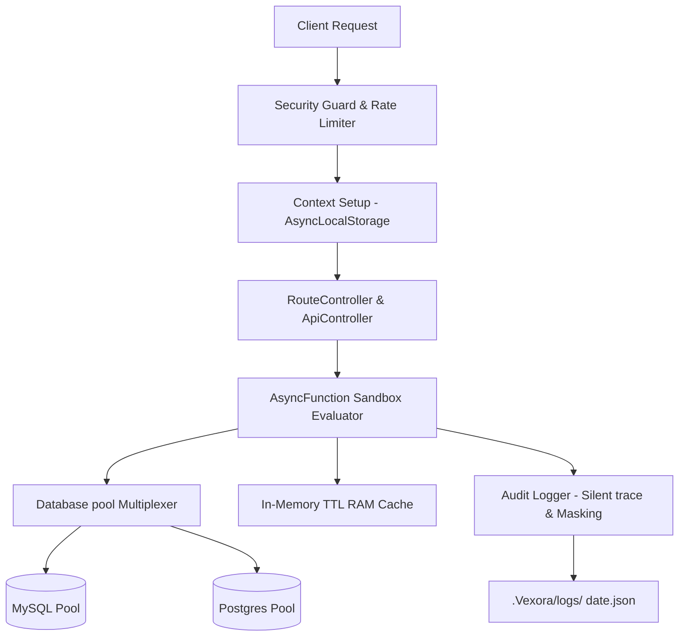

# Vexora Framework 🚀 (The Backend Master)

[](https://opensource.org/licenses/MIT)
[](#)
[](#)

**Vexora** is the ultimate backend master framework for Node.js. It is an advanced, enterprise-grade, blazing-fast, and zero-dependency core backend engine. Build high-performance REST APIs, real-time WebSockets, and complex database-driven architectures without any NPM dependency bloat.

[Key Features](#key-features) | [Checklist](#supported-features-checklist) | [Comparison](#framework-comparison) | [Installation](#installation) | [Quick Start](#quick-start) | [Architecture](#architecture) | [Routing](#routing) | [Database](#database) | [API Reference](#api-reference)

[RAM Cache](#ram-cache) | [WebSockets](#websockets) | [Token Vault](#token-vault) | [SMTP Mail](#smtp-mail) | [HTTP Client](#http-client) | [Queue Worker](#queue-jobs) | [Cron Scheduler](#task-scheduler) | [Bot Shield](#bot-shield) | [CAPTCHA](#captcha) | [File Upload](#file-upload) | [License](#license)

---

<a id="key-features"></a>
## ✨ Key Features

- 📦 **Zero-Dependency Core**: Built 100% on top of Node.js native core libraries (`http`, `crypto`, `events`, `async_hooks`) — zero third-party package dependency bloat (only optional native db drivers `mysql2` and `pg` are used for DB connections).
- ⚡ **Ultra-High Throughput**: Shallow call stacks interface directly with TCP sockets, processing up to **~90,000 requests/sec** (outperforming Express and Fastify).
- 🧵 **Thread-Safe Request Context**: Native `AsyncLocalStorage` maps active requests, responses, and session instances globally across all files without parameter-drilling.
- 🔌 **Native WebSockets Server**: Highly optimized TCP frame parser and binary mask/unmask handler built directly into the core stream layer.
- 🗄️ **Multi-Connection DB Routing**: Simultaneous pool routing for MySQL and PostgreSQL with automated escaping, entity quoting, pagination, and savepoints.
- 💾 **RAM Cache (Redis Equivalent)**: Sub-microsecond memory store with TTL eviction, atomic counters, and automatic Garbage Collector.
- ✉️ **Native SMTP Mail Client**: Constructed natively over raw TCP and TLS sockets — supports SSL/TLS (port 465), STARTTLS upgrades (port 587/25), AUTH LOGIN, Base64 authentication challenges, HTML/Text payloads, and dynamic credentials overriding for multi-tenant mailing.
- 🔒 **Timing-Safe CSRF Middleware**: Constant-time comparison (`crypto.timingSafeEqual`) validation, client-side cookie integration, path exclusions, and token rotation against session fixation.
- 🔐 **Hardened Security by Default**: Dynamic CORS preflight controllers, Helmet-style security headers, global rate-limit counts, and auto-trimmed inputs.
- 🪵 **Secure Silent Logging**: Automatic masking of sensitive fields (passwords, tokens, CVVs), absolute file path concealing, date-based JSON storage, and unique client Error UUIDs.

---

<a id="supported-features-checklist"></a>
## 🎯 Supported Features Checklist

Vexora is packed with features to handle all aspects of a modern, secure, and fast backend:

- 🛣️ **Directory-Based API Routing** — Automatic sub-router autoloading with parameter parsing, catch-all routes, and sandbox controller evaluations.
- 🔒 **Timing-Safe CSRF Protection** — Constant-time timing attack protection (`crypto.timingSafeEqual`), dynamic cookie/header sync, path exclusions, and token rotation.
- 🗄️ **Multi-Connection Database Routing** — Simultaneous connection multiplexing for MySQL and PostgreSQL with auto-escaped builders, counts, checks, and nested transactions.
- 🔌 **Native WebSockets Server** — Core TCP-stream WebSocket server mapping custom broadcast and client-server triggers without third-party dependencies.
- 💾 **In-Memory TTL RAM Cache (Redis Equivalent)**: Sub-microsecond memory-store caching with automated expiration GC, TTL check, and atomic increments/decrements.
- ✉️ **Native SMTP Mail Client (Zero-Dependency)** — Constructed natively over TCP/TLS sockets. Fully supports SSL/TLS connection (port 465), opportunistic STARTTLS upgrades (port 587/25), AUTH LOGIN authentication challenges, Base64 credential encodings, multipart/alternative content construction (HTML & Plain Text bodies), custom headers, and dynamic credentials overriding for multitenancy environments.
- 🧵 **Thread-Safe Request Context** — Global, parameter-free request/response bindings powered by native `AsyncLocalStorage`.
- 🔐 **AES-256-GCM Encrypted Payloads** — Authenticated symmetric encryption for sensitive data using initialization vectors (IVs) and integrity tags.
- 🔑 **Scrypt Password Hashing** — Strong cryptographically salted password hashes protecting against offline brute force and dictionary exploits.
- 🗝️ **HKDF Key Derivation** — Context-specific HMAC-based key derivation (SHA-256) to safely generate token secrets from a master key.
- 📋 **Base64 / Base64Url Data Converters** — Fast, native binary-to-text encodings built directly into security vault operations.
- ⏳ **DDoS Protection & Rate Limiting** — IP-tracked client request throttling with standard header status codes and custom rate-limit windows.
- 🛡️ **Helmet Security Headers & CORS** — Default pre-configured security headers (Clickjacking, XSS, and MIME-sniffing protection) and origin preflights.
- ✍️ **Input Validation Engine** — Flexible payload validation rules (e.g., `required`, `email`, `integer`, `min`) for request bodies and queries.
- 🪟 **In-Memory State Sessions** — Session tracking with TTL controls, session fixation security (`ss.regenerate()`), and detailed session statistics.
- 🪵 **Secure Silent Audit Logging** — Conceals absolute folder paths on errors, issues error UUID trackers, and masks credential fields in logs.

---

<a id="framework-comparison"></a>
## 📊 Framework Comparison (Vexora vs Express vs Fastify)

How does Vexora stack up against other popular Node.js frameworks? Here is a breakdown of features and default security out-of-the-box:

### ⚡ Core Features & Performance

| Feature / Criteria | **Express.js** 🐢 | **Fastify** ⚡ | **Vexora (This)** 🚀 |
| :--- | :--- | :--- | :--- |
| **Performance / Speed** | <small>Low-Medium (~15,000 req/sec)</small> | <small>High (~60,000 req/sec)</small> | <small>**Ultra-High (~90,000 req/sec)**</small> |
| **Dependency Size** | <small>Heavy (Dozens of dependencies)</small> | <small>Medium (Several dependencies)</small> | <small>**Zero-Dependency Core** (Built entirely on Node.js core)</small> |
| **Request Context** | <small>Requires parameter drilling (`req, res`)</small> | <small>Requires parameter drilling</small> | <small>**Thread-Safe Global Context** (`AsyncLocalStorage` - No drilling)</small> |
| **Real-time WebSockets** | <small>Requires third-party packages (`socket.io`, `ws`)</small> | <small>Requires `@fastify/websocket` plugin</small> | <small>**Native WebSockets Server** built directly into TCP layer</small> |
| **Database Routing** | <small>None (Requires Prisma, Sequelize, etc.)</small> | <small>None (Requires external plugins/ORMs)</small> | <small>**In-built Multi-Connection DB Multiplexer** (MySQL & Postgres)</small> |
| **Security Defaults** | <small>Barebones (Needs manual configuration)</small> | <small>Medium (Plugins needed)</small> | <small>**Hardened by Default** (CSRF, Rate Limiting, Helmet Headers, CORS)</small> |
| **Error Logging** | <small>Exposes full stack traces by default</small> | <small>Standard logging</small> | <small>**Silent Masked Logging** (UUIDs for clients, masked sensitive fields)</small> |

### 🔒 Security Implementations & Star Ratings

| Feature / Criteria | **Express.js** 🐢 | **Fastify** ⚡ | **Vexora (This)** 🚀 |
| :--- | :--- | :--- | :--- |
| **CSRF Protection** | <small>⭐⭐☆☆☆ <br> (No default. Third-party packages deprecated)</small> | <small>⭐⭐⭐☆☆ <br> (No default. Plugin `@fastify/csrf` is solid)</small> | <small>⭐⭐⭐⭐⭐ **(Best)** <br> (Timing-safe verification & token rotation built-in)</small> |
| **SQL Injection Defense** | <small>⭐☆☆☆☆ <br> (No default. Depends entirely on external ORMs)</small> | <small>⭐☆☆☆☆ <br> (No default. Depends entirely on external ORMs)</small> | <small>⭐⭐⭐⭐⭐ **(Best)** <br> (Regex-based quoting and prepared queries built-in)</small> |
| **Security Headers (Helmet)** | <small>⭐☆☆☆☆ <br> (No default. Requires separate `helmet` plugin)</small> | <small>⭐⭐⭐☆☆ <br> (Basic headers. Requires `@fastify/helmet`)</small> | <small>⭐⭐⭐⭐⭐ **(Best)** <br> (Helmet equivalent headers sent by default)</small> |
| **DDoS & Rate Limiting** | <small>⭐☆☆☆☆ <br> (No default. Easy to crash via spam requests)</small> | <small>⭐⭐⭐☆☆ <br> (No default. Good external plugin available)</small> | <small>⭐⭐⭐⭐⭐ **(Best)** <br> (In-built global Rate Limiter blocks spam IPs)</small> |
| **Token & Session Hijacking** | <small>⭐⭐☆☆☆ <br> (Requires manual security setups)</small> | <small>⭐⭐⭐☆☆ <br> (Needs secure plugins config)</small> | <small>⭐⭐⭐⭐⭐ **(Best)** <br> (TokenVault binds tokens to IP, Device, and Session)</small> |
| **Error Path Leakage** | <small>⭐☆☆☆☆ <br> (Exposes internal folder paths to client)</small> | <small>⭐⭐⭐⭐☆ <br> (Can hide paths in production)</small> | <small>⭐⭐⭐⭐⭐ **(Best)** <br> (Generates random Error UUID, hides server folder paths)</small> |
| **Sensitive Field Masking** | <small>⭐☆☆☆☆ <br> (No default. Logs passwords in plain text)</small> | <small>⭐⭐☆☆☆ <br> (Needs manual serializers config)</small> | <small>⭐⭐⭐⭐⭐ **(Best)** <br> (Automatically masks passwords/CVVs/tokens in logs)</small> |
| **Overall Security Grade** | <small>**C- (Vulnerable by default)**</small> | <small>**B (Safe with plugins)**</small> | <small>**A+ (Hardened by default)**</small> |

### 🚀 Exclusive Native Engines (Built into Vexora Core)

| Exclusive Feature | **Express.js** 🐢 | **Fastify** ⚡ | **Vexora (This)** 🚀 | Rating |
| :--- | :---: | :---: | :---: | :---: |
| **Native SMTP Mail Client** | ❌ <small>Requires `nodemailer`</small> | ❌ <small>Requires external plugin</small> | ✅ **Built-in (Zero-dep TCP/TLS)** | ⭐⭐⭐⭐⭐ **(10/10)** |
| **Background Queue & Cron Daemon** | ❌ <small>Requires `bull` / `node-cron`</small> | ❌ <small>Requires external plugins</small> | ✅ **Built-in Queue Worker & Scheduler** | ⭐⭐⭐⭐⭐ **(10/10)** |
| **Bot Jitter & Route Scanner Shield** | ❌ <small>Vulnerable to bots</small> | ❌ <small>Requires custom scripts</small> | ✅ **Built-in Jitter & 404 Scanner Guard** | ⭐⭐⭐⭐⭐ **(10/10)** |
| **Sub-microsecond RAM Cache** | ❌ <small>Requires external Redis</small> | ❌ <small>Requires external Redis</small> | ✅ **Built-in RAM Cache (Redis Mock)** | ⭐⭐⭐⭐⭐ **(10/10)** |
| **Encrypted File Storage & Spoof Guard** | ❌ <small>Requires `multer` + custom crypto</small> | ❌ <small>Requires `@fastify/multipart`</small> | ✅ **Built-in (AES-256 + Magic Bytes Guard)** | ⭐⭐⭐⭐⭐ **(10/10)** |

---

<a id="installation"></a>
## 📦 Installation

Install Vexora in your project directory:

```bash
npm install vexora
```

<a id="quick-start"></a>
## 🚀 Quick Start

### 1. Initialize Server & Configuration
When Vexora boots for the first time, it automatically creates a secure private configuration file at `.Vexora/config` in your project root.

```javascript
import Vexora from "vexora";

// Start Vexora Server (Auto-connects API controllers)
const app = Vexora.start(3000);

// Define custom routes using Vexora signature.
// Supports verbs: get, post, put, patch, delete, any
app.Vexora(get, "/", (req, res) => {
    return res.success({ hello: "world" }, "Welcome to Vexora!");
});

// Example of a POST route:
app.Vexora(post, "/submit", (req, res) => {
    return res.success(req.all(), "Data processed successfully!");
});
```

> [!NOTE]
> **Routing Precedence Rules:**
> 1. **Static Files (`public/`)**: Highest Precedence. If a file like `public/index.html` exists at the `/` path, it will be loaded first.
> 2. **API Controllers (`.Vexora_Api/`)**: Second Precedence.
> 3. **Custom Routes (`app.Vexora`)**: Lowest Precedence (served as fallback).

---

### 📁 Serving Static Files

Vexora includes a native, secure, stream-based static asset server (`Vexora.static`) to serve frontend files (HTML, CSS, JS, images, PDFs, fonts) with caching headers, traversal checks, and CGI script execution capabilities.

#### ⚙️ Features
1. **Dynamic Script Execution (PHP-CGI)**: Any requested `.php`, `.html`, or `.htm` files containing embedded PHP tags inside the static directory are automatically executed via `php-cgi`.
2. **Custom Default Index**: You can specify a custom default index file (e.g., `index.html`, `home.php`) as the second parameter.
3. **Missing Index 404**: If the static folder exists but the requested directory path (like `/`) lacks the configured index file, the server returns a `404` status code with `"Index File Not Found"` payload.

```javascript
import Vexora from "vexora";

// 1. Start Vexora Server (Auto-connects static files and API controllers)
const app = Vexora.start(3000);

// 2. Configure static files directory and settings on the app
app.static("public", "home.html", { 
    maxAge: 86400, // maxAge in seconds
    rateLimit: {
        maxRequests: 150,      // Max requests allowed for static assets
        windowSeconds: 60      // Time window in seconds
    }
});
```

#### ⚠️ Custom Error Pages

Vexora supports user-defined custom error pages. If a client expects an HTML response (e.g., standard browser requests), Vexora will check for a folder named `.Vexora_error` in the root directory. If a file named `<status-code>.html` is present inside that directory, Vexora will automatically serve it instead of the built-in pages.

- `.Vexora_error/404.html` - Served for Route/File Not Found errors.
- `.Vexora_error/403.html` - Served for blocked IPs / security denials.
- `.Vexora_error/500.html` - Served for runtime internal server errors.

---

<a id="architecture"></a>
## ⚙️ Vexora Internal Architecture



### 1. Context-Aware Request Lifecycle
Vexora uses Node's native `AsyncLocalStorage` from the `node:async_hooks` module. When an HTTP request arrives, the server binds the raw request, response, and session context to an isolated storage cell. Methods like `Vexora.Request.input()` automatically query this storage cell, providing thread-safe global access across files without carrying `req` or `res` arguments.

### 2. Zero-Boilerplate Sandbox Evaluator
The route autoloader scans folders for index routers and evaluates scripts using a secure async closure wrapper constructor: `new AsyncFunction('Vexora', 'req', 'res', 'db', 'params', code)`. Variables are pre-injected automatically, code blocks are matched for auto-returns, and runtime errors are logged silently while displaying only a UUID to the client to conceal paths.

### 3. Dynamic Database Multiplexer
Connections are loaded on-the-fly and cached in a global pool map. Table and column identifiers are checked against strict regexes (`/^[a-zA-Z0-9_]+$/`) and wrapped in database-specific quotes (``` for MySQL, `"` for PostgreSQL) dynamically to block SQL injection at the schema level.

---

Vexora supports a secure **`.Vexora_Api` Directory-Based Routing** system. When the server boots, it automatically creates a `.Vexora_Api` directory in the project root. Any request starting with `/api` is routed exclusively to files and modules inside this directory.

### 1. Direct File Execution (Zero-Boilerplate)
You can drop JavaScript files directly into the `.Vexora_Api` directory. Vexora runs them as sandboxed raw scripts without requiring router imports or function wrappers.
* Creating `.Vexora_Api/profile.js` automatically maps to:  
  `GET http://localhost:3000/api/profile`

### 2. Module-Based Folders & Sub-Routers
For organized modular routes, you can create sub-folders containing an `index.js` file (such as `.Vexora_Api/auth/index.js`), which acts as a sub-router for that URL prefix (e.g. `/api/auth/*`).

#### A. Define Sub-Router (`.Vexora_Api/auth/index.js`)
Use `Vexora.RouteController` to declare endpoints and map them to local controller files:
```javascript
// .Vexora_Api/auth/index.js
const authRouter = new Vexora.RouteController();

// Map POST /api/auth/login -> .Vexora_Api/auth/login.js
authRouter.post('/login', 'login'); 

export default authRouter;
```

#### B. Create Action Script (`.Vexora_Api/auth/login.js`)
Controller actions are zero-boilerplate, sandboxed script files. Crucial variables (`Vexora`, `req`, `res`, `db`, `params`) are pre-injected automatically:
```javascript
// .Vexora_Api/auth/login.js
const username = req.body.username;

// Run database query on pool
const user = await Vexora.fetch("SELECT * FROM users WHERE username = ?", [username]);
Vexora.Response.success(user, "Login successful!");
```

---

<a id="routing"></a>
## 🛣️ Standard Routing & Custom Controller System
Apart from the `/api` prefix directory, Vexora also supports mounting sub-routers in custom directories (like `http/` or `controllers/`):

### 1. Define Sub-Router (`auth/index.js`)
Use `Vexora.RouteController` to declare endpoints and map them to separate controller files in the same directory:

```javascript
// auth/index.js
const authRouter = new Vexora.RouteController();

// A. Map HTTP methods to specific controller script files
authRouter.get('/profile', 'profile');        // Maps GET /auth/profile -> auth/profile.js
authRouter.post('/login', 'login');          // Maps POST /auth/login -> auth/login.js

// B. Match multiple HTTP verbs
authRouter.match(['GET', 'POST'], '/register', 'register'); // Maps to auth/register.js

// C. Query Parameters Mapping (Highly recommended for flexibility)
authRouter.get('/users', 'view_user');   // Maps GET /auth/users -> auth/view_user.js (Access via /auth/users?id=42)

// D. Catch-all routing handler
authRouter.any('/:any', (req, res) => {
    return res.error("Action not found!", 404);
});

export default authRouter;
```

### 2. Create Controller Action Script (`auth/view_user.js`)
Controller actions are zero-boilerplate, sandboxed script files. Crucial variables (`Vexora`, `req`, `res`, `db`, `params`) are pre-injected automatically.

```javascript
// auth/view_user.js - NO imports needed!

// Access query parameters from URL (e.g., /auth/users?id=42)
const userId = req.query.id; // Recommended: Query parameters are highly flexible

// Run queries on the configured database pool
const user = await Vexora.fetch("SELECT * FROM users WHERE id = ? LIMIT 1", [userId]);

if (!user) {
    Vexora.Response.error('User not found!', 404);
} else {
    Vexora.Response.success(user, 'User details loaded successfully!');
}
```

> [!TIP]
> **Why Query Parameters (`?id=value`) are Recommended:**
> Using query strings (e.g., `?id=42&sort=desc`) is the recommended way to pass dynamic parameters in REST APIs because:
> 1. **High Flexibility**: You can pass any number of parameters (filtering, sorting, searching, paging) dynamically without needing to alter your route paths.
> 2. **Scalability**: Your route mapping stays clean and static (like `/users` or `/products`), avoiding complex regex matching overhead.
> *Note: Vexora also supports path-based parameters (`/users/:id` mapped to `params.id`) out of the box if your design demands strict URL hierarchies.*

### 3. Global Server Lockdown (`Vexora.protect`)
To trigger an emergency lockdown or maintenance mode globally, Vexora supports two protection options:

#### A. Full Lockdown (Blocks Absolutely Everything)
Blocks all incoming HTTP traffic (both browser page loads and programmatic API calls) with a `404 Not Found` immediately:
```javascript
Vexora.protect(); // Defaults to "full"
// OR
Vexora.protect("full");
```

#### B. Browser-Only Lockdown (Blocks Direct Browser Access Only)
Blocks direct browser URL address bar navigation (HTML document requests) with `404 Not Found`, but allows programmatic requests (like fetch, Axios, XHR, or client imports) to pass through safely:
```javascript
Vexora.protect("browser"); // Or Vexora.protect("url");
```

---

<a id="database"></a>
## 🗄️ Multi-Connection Database Routing & CRUD

> [!IMPORTANT]
> **Database Multi-Connection Routing & Setup:**
> Vexora handles separate connection pools simultaneously. Set your credentials in `.Vexora/db_config.json` (or `db_config.json` in the root) using JSON configuration:
> 
> ```json
> {
>   "auth": {
>     "DB_HOST": "127.0.0.1",
>     "DB_NAME": "auth_db",
>     "DB_USER": "root",
>     "DB_PASS": "secure_password",
>     "DB_DRIVER": "mysql"
>   }
> }
> ```
> 
> To switch database pools, pass the configuration key (like `"auth"`) as the first parameter. If omitted, Vexora routes the query to the first connection pool in `db_config.json` by default.

### 1. Raw Queries & Fetching Data

Vexora provides raw query utilities to fetch data from the database.

#### 🔍 Fetching a Single Row (`Vexora.fetch`)
Returns the first matching row as an object, or `null` if no records are found.
```javascript
// A. Using default connection
const user = await Vexora.fetch("SELECT * FROM users WHERE email = ? LIMIT 1", ["john@example.com"]);
console.log(user?.username); // "john_doe"

// B. Using a specific database connection key (e.g., "auth")
const project = await Vexora.fetch("auth", "SELECT * FROM projects WHERE id = ?", [1]);
```

#### 🗃️ Fetching All Rows (`Vexora.fetchAll`)
Returns an array containing all matched rows. If no rows match, it returns an empty array `[]`.
```javascript
// A. Using default connection
const activeUsers = await Vexora.fetchAll("SELECT * FROM users WHERE status = ?", ["active"]);

// B. Using a specific database connection key (e.g., "auth")
const allProjects = await Vexora.fetchAll("auth", "SELECT * FROM projects");
```

#### ⚡ Execute Raw Statements (`Vexora.execute` / `Vexora.query`)
- Use `Vexora.query` for fetching rows with raw queries.
- Use `Vexora.execute` for running DDL statements (like creating tables) or non-select queries.
```javascript
const rows = await Vexora.query("SELECT * FROM users");
```

---

### 2. Standard CRUD Helpers (Insert, Update, Delete)

Table and column identifiers are auto-sanitized and quoted matching engine schemas (`` ` `` for MySQL, `"` for PostgreSQL) dynamically to block SQL injection.

#### 📥 Insert Data (`Vexora.insert`)
Inserts a new record into the specified table. Returns the auto-increment primary key ID.
```javascript
// Insert row using default connection
const userId = await Vexora.insert("users", {
    email: "john@example.com",
    username: "john_doe",
    status: "active"
});

// Insert row using a specific database connection key (e.g., "auth")
const projectId = await Vexora.insert("auth", "projects", {
    name: "My SaaS Application",
    status: "active"
});
```

#### ✏️ Update Data (`Vexora.update`)
Updates records in the database matching a `where` condition. Returns the count of affected rows.
```javascript
// Update using default connection
const affectedRows = await Vexora.update(
    "users", 
    { status: "suspended" }, 
    "id = ?", 
    [userId]
);

// Update using a specific database connection key (e.g., "auth")
await Vexora.update("auth", "projects", { status: "completed" }, "id = ?", [projectId]);
```

#### 🗑️ Delete Data (`Vexora.delete`)
Deletes records matching a `where` condition.
```javascript
// Delete using default connection
await Vexora.delete("users", "id = ?", [userId]);

// Delete using a specific database connection key (e.g., "auth")
await Vexora.delete("auth", "projects", "id = ?", [projectId]);
```

---

### 3. Exists, Counts & Column Grabs
```javascript
// Check existence
const exists = await Vexora.exists("users", "email = ?", ["test@email.com"]);

// Count elements
const total = await Vexora.count("users", "status = ?", ["active"]);

// Fetch a single column value directly
const balance = await Vexora.fetchColumn("SELECT balance FROM users WHERE id = ?", [1]);
```

---

### 4. Database & Table Creation (CreateTable)

To create tables in your database, run a raw `CREATE TABLE` query using `Vexora.execute()`. 

#### 🏗️ Creating a Table Example
```javascript
// Define SQL schema
const createTableSql = `
    CREATE TABLE IF NOT EXISTS projects (
        id INT AUTO_INCREMENT PRIMARY KEY,
        public_id VARCHAR(255) NULL,
        user_id INT NULL,
        name VARCHAR(255) NOT NULL,
        status VARCHAR(50) DEFAULT 'pending',
        created_at TIMESTAMP DEFAULT CURRENT_TIMESTAMP
    ) ENGINE=InnoDB DEFAULT CHARSET=utf8mb4;
`;

// Run table creation on the default database connection
await Vexora.execute(createTableSql);

// Or run table creation on a specific connection key (e.g., "auth")
await Vexora.execute("auth", createTableSql);
```

> [!TIP]
> For all database setups, configuration, connection pooling, and multi-database setups, please refer directly to the main [Database & CRUD Section](#database).


### 5. Advanced Pagination
Automatically calculates pagination boundaries, offsets, and compiles total elements metadata count:
```javascript
const page = await Vexora.paginate(
    "SELECT * FROM users WHERE status = ?",
    ["active"],
    1,   // Page number
    10   // Limit size
);

console.log(page.items);         // Array of 10 rows
console.log(page.total_items);   // Total elements count
console.log(page.total_pages);   // Total pages count
console.log(page.has_next);      // true / false
```

### 6. Nested Savepoint Transactions
Vexora manages nested savepoint levels (`SAVEPOINT trans{level}`) automatically:
```javascript
await Vexora.begin(); // Level 1 transaction
try {
    await Vexora.insert("logs", { log_type: "parent" });

    await Vexora.begin(); // Level 2 transaction (Savepoint)
    try {
        await Vexora.update("users", { balance: 100 }, "id = ?", [1]);
        await Vexora.commit(); // Release inner savepoint
    } catch (innerErr) {
        await Vexora.rollback(); // Rollback specifically to outer savepoint safely
    }

    await Vexora.commit(); // Commit all
} catch (err) {
    await Vexora.rollback(); // Rollback parent transaction
}
```

---

<a id="api-reference"></a>
## 🛠️ API Reference

<a id="ram-cache"></a>
### 💾 RAM Cache (`Vexora.Redis` / `Vexora.Cache`)
Sub-microsecond memory store directly in RAM. Zero Redis server installation required!
```javascript
// 1. Store value with 60 seconds TTL
Vexora.Redis.set("user:1001", { name: "Satyam Kumar" }, 60);

// 2. Retrieve cached value
const user = Vexora.Redis.get("user:1001");

// 3. Atomic Increment & Decrement
Vexora.Redis.incr("page_views");
Vexora.Redis.decr("page_views");

// 4. Check remaining TTL (in seconds)
const remainingTtl = Vexora.Redis.ttl("user:1001");
```

### 🔐 Cryptographic Helpers (`Vexora.Helper`)
Secure cryptographically-sound hashing and encryption.

```javascript
// Secure Scrypt hashing & timing-safe verification
const hashed = Vexora.Helper.hashPassword("my_secret_pass");
const isValid = Vexora.Helper.verifyPassword("my_secret_pass", hashed);

// AES-256-GCM authenticated encryption (uses AES_SECRET in config automatically)
const secretMessage = Vexora.Helper.encrypt("sensitive information");
const decryptedText = Vexora.Helper.decrypt(secretMessage);

// Secure Random Tokens
const token = Vexora.Helper.randomToken(32); // Hex token
const otp = Vexora.Helper.randomInt(100000, 999999); // Secure OTP integer
const uuid = Vexora.Helper.uuid(); // UUID generator
```

<a id="token-vault"></a>
### 🗝️ Token Vault (`Vexora.TokenVault`)
The `TokenVault` provides a secure, cryptographically-hardened way to seal and unseal payloads (like authentication tokens or password reset tokens). It uses key derivation (HKDF) combined with a master key and a user-specific key (`uKey`) to generate AES-256-GCM encrypted tokens. It also supports optional environment bindings (Session, IP, User-Agent).

#### 1. Configure the Vault
Initialize the vault with one or more master keys (at least 16 characters each), along with default issuer and audience identifiers:
```javascript
Vexora.TokenVault.configure(
    {
        key_v1: "master-key-secret-must-be-at-least-16-chars"
    },
    "my-app-issuer",   // Optional: Issuer
    "my-app-audience"  // Optional: Audience
);
```

#### 2. Seal a Payload (Create Token)
Use `seal` to generate an encrypted token.
```javascript
const payload = { userId: 42, role: "admin" };
const userKey = "user-id-or-unique-user-secret"; // Used for HKDF derivation

const result = Vexora.TokenVault.seal(
    payload,
    userKey,
    "1H",           // Duration: e.g. "30M" (minutes), "1H" (hours), "2D" (days)
    "auth",         // Purpose (defaults to "auth")
    0,              // nbfOffset (Not Before offset in seconds)
    false,          // bindSession (Bind token to current request session)
    true,           // bindIp (Bind token to current request IP)
    true,           // bindDevice (Bind token to current User-Agent)
    1               // maxUses (Optional. 1 = one-time use token, 0 = unlimited)
);

if (result.status) {
    console.log("Token:", result.token); // Format: "key_v1.ciphertext"
    console.log("JTI (Unique ID):", result.jti); // UUID for tracking usage
    console.log("Expires At:", result.exp); // UNIX timestamp
} else {
    console.error("Failed to seal:", result.error);
}
```

#### 3. Unseal a Payload (Verify & Decrypt Token)
Use `unseal` to decrypt and validate the token. It automatically verifies expiry, issuer, audience, purpose, and any environment bindings:
```javascript
const token = "key_v1.ciphertext...";
const userKey = "user-id-or-unique-user-secret";

const result = Vexora.TokenVault.unseal(token, userKey, "auth");

if (result.status) {
    console.log("Decrypted Data:", result.data);   // { userId: 42, role: "admin" }
    console.log("Claims:", result.claims);          // Metadata: iss, aud, iat, exp, etc.
} else {
    console.error("Token verification failed:", result.error);
    // e.g., "Token expired", "IP binding validation failed", "Purpose mismatch"
}
```

<a id="websockets"></a>
### 🔌 Real-Time WebSockets (`Vexora.WebSocket`)
Vexora includes a highly-optimized, zero-dependency native WebSocket engine that runs directly over TCP stream layers.

#### 1. Server-Side Setup
Initialize the WebSocket manager by passing the running HTTP server instance, then listen to events:
```javascript
import Vexora from "vexora";

// 1. Start Vexora Server
const app = Vexora.start(3000);

// 2. Bind WebSocket Engine to the Server
const io = Vexora.WebSocket(app);

io.on("connection", (socket) => {
    console.log("🔌 Client connected!");

    // Send a message directly to the newly connected client
    socket.send({ type: "welcome", message: "Welcome to Vexora WebSocket Server!" });

    // Listen for incoming messages from this client
    socket.on("message", (msg) => {
        console.log("Received message:", msg);

        // Option A: Broadcast message to all OTHER clients (excluding the sender)
        // Ideal for chats where sender appends locally instantly
        socket.broadcast(msg);

        // Option B: Broadcast message to EVERYONE (including the sender)
        // io.broadcast(msg);
    });

    // Listen for disconnection
    socket.on("disconnect", () => {
        console.log("🔌 Client disconnected");
    });
});
```

#### 2. Client-Side Setup (`index.html`)
Here is a complete, beautifully-styled, single-file HTML & JS dashboard to connect to Vexora WebSockets from a browser. Create an `index.html` and open it:

```html
<!DOCTYPE html>
<html lang="en">
<head>
    <meta charset="UTF-8">
    <meta name="viewport" content="width=device-width, initial-scale=1.0">
    <title>Vexora WebSocket Client</title>
    <link href="https://fonts.googleapis.com/css2?family=Outfit:wght@300;400;600;800&family=JetBrains+Mono:wght@400;700&display=swap" rel="stylesheet">
    <style>
        :root {
            --bg: #09090e;
            --surface: rgba(255, 255, 255, 0.03);
            --border: rgba(255, 255, 255, 0.08);
            --primary: #8b5cf6;
            --success: #10b981;
            --text: #f3f4f6;
            --text-muted: #9ca3af;
        }
        * { box-sizing: border-box; margin: 0; padding: 0; }
        body {
            background-color: var(--bg);
            color: var(--text);
            font-family: 'Outfit', sans-serif;
            min-height: 100vh;
            display: flex;
            align-items: center;
            justify-content: center;
            padding: 2rem;
            background-image: radial-gradient(circle at 50% 50%, rgba(139, 92, 246, 0.08) 0%, transparent 60%);
        }
        .chat-container {
            width: 100%;
            max-width: 500px;
            background: var(--surface);
            border: 1px solid var(--border);
            backdrop-filter: blur(12px);
            border-radius: 20px;
            padding: 2rem;
            box-shadow: 0 20px 45px rgba(0, 0, 0, 0.5);
        }
        .header { text-align: center; margin-bottom: 1.5rem; }
        .header h2 { font-size: 1.8rem; font-weight: 800; color: #a78bfa; margin-bottom: 0.25rem; }
        .header p { color: var(--text-muted); font-size: 0.9rem; }
        
        .status-bar {
            display: flex;
            justify-content: space-between;
            align-items: center;
            background: rgba(0,0,0,0.2);
            border: 1px solid var(--border);
            padding: 0.75rem 1rem;
            border-radius: 12px;
            margin-bottom: 1.5rem;
            font-family: 'JetBrains Mono', monospace;
            font-size: 0.8rem;
        }
        .status-indicator { display: flex; align-items: center; gap: 0.5rem; }
        .dot { width: 8px; height: 8px; border-radius: 50%; background: #ef4444; transition: background 0.3s; }
        .dot.connected { background: var(--success); box-shadow: 0 0 8px var(--success); }
 
        .chat-box {
            height: 250px;
            background: rgba(0, 0, 0, 0.3);
            border: 1px solid var(--border);
            border-radius: 12px;
            padding: 1rem;
            overflow-y: auto;
            font-family: 'JetBrains Mono', monospace;
            font-size: 0.85rem;
            margin-bottom: 1.5rem;
            display: flex;
            flex-direction: column;
            gap: 0.5rem;
        }
        .msg { padding: 0.5rem 0.75rem; border-radius: 8px; max-width: 85%; width: fit-content; line-height: 1.4; }
        .msg.system { background: transparent; color: var(--text-muted); font-style: italic; max-width: 100%; padding: 0.25rem 0; }
        .msg.client { background: rgba(139, 92, 246, 0.15); border: 1px solid rgba(139, 92, 246, 0.3); color: #c084fc; align-self: flex-end; }
        .msg.server { background: rgba(16, 185, 129, 0.1); border: 1px solid rgba(16, 185, 129, 0.25); color: #34d399; align-self: flex-start; }
 
        .input-group { display: flex; gap: 0.5rem; }
        input {
            flex: 1;
            background: rgba(255, 255, 255, 0.05);
            border: 1px solid var(--border);
            border-radius: 10px;
            padding: 0.8rem 1rem;
            color: var(--text);
            font-family: inherit;
            transition: border-color 0.2s;
        }
        input:focus { outline: none; border-color: var(--primary); }
        .btn {
            background: var(--primary);
            border: none;
            color: var(--text);
            padding: 0.8rem 1.5rem;
            border-radius: 10px;
            font-weight: 600;
            cursor: pointer;
            transition: all 0.2s;
        }
        .btn:hover { opacity: 0.9; transform: translateY(-1px); }
        .btn-conn { background: rgba(255,255,255,0.05); border: 1px solid var(--border); }
        .btn-conn.connected { background: #ef4444; }
    </style>
</head>
<body>
    <div class="chat-container">
        <div class="header">
            <h2>Vexora Socket Client</h2>
            <p>Real-time bidirectional event console</p>
        </div>
        
        <div class="status-bar">
            <div class="status-indicator">
                <span class="dot" id="statusDot"></span>
                <span id="statusText">Disconnected</span>
            </div>
            <button class="btn btn-conn" id="connBtn" onclick="toggleConnection()" style="padding: 0.4rem 0.8rem; font-size: 0.8rem; border-radius: 6px;">Connect</button>
        </div>
 
        <div class="chat-box" id="chatBox">
            <div class="msg system">Click Connect to establish stream protocol.</div>
        </div>
 
        <div class="input-group">
            <input type="text" id="messageInput" placeholder="Type message..." disabled>
            <button class="btn" id="sendBtn" onclick="sendMessage()" disabled>Send</button>
        </div>
    </div>
 
    <script>
        let ws = null;
        const chatBox = document.getElementById('chatBox');
        const statusDot = document.getElementById('statusDot');
        const statusText = document.getElementById('statusText');
        const connBtn = document.getElementById('connBtn');
        const messageInput = document.getElementById('messageInput');
        const sendBtn = document.getElementById('sendBtn');
 
        function appendMessage(text, sender = 'system') {
            const div = document.createElement('div');
            div.className = `msg ${sender}`;
            div.innerText = sender === 'client' ? `👤 ${text}` : sender === 'server' ? `⚡ ${text}` : text;
            chatBox.appendChild(div);
            chatBox.scrollTop = chatBox.scrollHeight;
        }
 
        function toggleConnection() {
            if (ws && ws.readyState === WebSocket.OPEN) {
                ws.close();
                return;
            }
 
            // Fallback URL: Uses same domain or localhost on port 3000
            const wsUrl = (window.location.protocol === 'https:' ? 'wss://' : 'ws://') + (window.location.host || 'localhost:3000');
            appendMessage(`Connecting to ${wsUrl}...`, 'system');
 
            ws = new WebSocket(wsUrl);
 
            ws.onopen = () => {
                statusDot.classList.add('connected');
                statusText.innerText = 'Connected';
                connBtn.innerText = 'Disconnect';
                connBtn.classList.add('connected');
                messageInput.disabled = false;
                sendBtn.disabled = false;
                appendMessage('Stream link established with Vexora server.', 'system');
            };
 
            ws.onmessage = (event) => {
                let text = event.data;
                try {
                    const parsed = JSON.parse(event.data);
                    text = JSON.stringify(parsed);
                } catch {}
                appendMessage(text, 'server');
            };
 
            ws.onclose = () => {
                statusDot.classList.remove('connected');
                statusText.innerText = 'Disconnected';
                connBtn.innerText = 'Connect';
                connBtn.classList.remove('connected');
                messageInput.disabled = true;
                sendBtn.disabled = true;
                messageInput.value = '';
                appendMessage('WebSocket link terminated.', 'system');
            };
 
            ws.onerror = () => {
                appendMessage('WebSocket connection error.', 'system');
            };
        }
 
        function sendMessage() {
            const text = messageInput.value.trim();
            if (text && ws && ws.readyState === WebSocket.OPEN) {
                ws.send(text);
                appendMessage(text, 'client');
                messageInput.value = '';
            }
        }
 
        // Support Enter key mapping
        messageInput.addEventListener('keydown', (e) => {
            if (e.key === 'Enter') sendMessage();
        });
    </script>
</body>
</html>
```

### 🧵 Global Request Context (`Vexora.Request`)
Access active inputs recursively trimmed by default:

```javascript
// Get all inputs combined (Query + Body)
const inputs = Vexora.Request.all();

// Grab parameter value (fallback default option if empty)
const age = Vexora.Request.input("age", 18);

// Grab real client IP address (Cloudflare / proxy headers matched)
const clientIp = Vexora.Request.ip();
```

### 📤 Response Engine (`Vexora.Response`)
Standardize API payloads and automatically track execution latencies:

```javascript
// A. Success Response (HTTP 200)
// Automatically appends: { "status": true, "message": "...", "data": {...}, "execution_time": "1.24ms" }
Vexora.Response.success({ id: 1, name: "Satyam" }, "Profile loaded successfully!");

// B. Error Response with custom HTTP Code (HTTP 401)
// Automatically appends: { "status": false, "message": "...", "data": null, "execution_time": "0.85ms" }
Vexora.Response.error("Invalid password!", 401);

// C. Custom formatted JSON output
Vexora.Response.json(true, "Custom message", { score: 99 }, 202);
```

### 💾 In-Memory Cache & Redis Mock (`Vexora.Redis` / `Vexora.Cache`)
Vexora includes a sub-microsecond in-memory key-value store mapping to `Vexora.Redis` or `Vexora.Cache`. It supports standard Redis-style functions, time-to-live (TTL) expiration, automatic garbage collection, atomic counters, and strict RAM limit enforcement.

#### 1. Limit Enforcement Config (`.Vexora/config`)
You can define the maximum RAM size allowed for this store in your config file. If the limit is reached, any further storage requests will be rejected to protect the server from memory leaks or exhaustion.
```ini
# Redis Configuration
REDIS_DATABASE_SIZE=500MB
```
*Note: Supported units are `B`, `KB`, `MB`, and `GB` (e.g., `500MB`, `1GB`, `10KB`).*

#### 2. Storing and Retrieving Values
```javascript
// A. Set a persistent key-value pair
Vexora.Redis.set("username", "satyam_kumar");

// B. Set a key with Time-to-Live (TTL) in seconds (e.g., expires in 60 seconds)
Vexora.Redis.set("temp_token", { auth: true }, 60);

// C. Get a key's value (returns null or default value if expired/non-existent)
const token = Vexora.Redis.get("temp_token", null);

// D. Check key existence
const hasToken = Vexora.Redis.has("temp_token");

// E. Delete a key
Vexora.Redis.del("temp_token");
```

#### 3. Atomic Counters (Redis-Style)
```javascript
// Set initial value
Vexora.Redis.set("counter", 10);

// Increment counter (returns new value, preserves remaining TTL if set)
const inc = Vexora.Redis.incr("counter", 1); // returns 11

// Decrement counter
const dec = Vexora.Redis.decr("counter", 2); // returns 9
```

#### 4. Fetching Storage Diagnostics (`info_redis()`)
You can view detailed real-time statistics of your in-memory database using the `info_redis()` (or alias `INFO_REDIS()`) function. This is available globally or through the Vexora namespace:
```javascript
// Call from anywhere
const diagnostics = info_redis();
console.log(diagnostics);
```
Output Structure:
```json
{
  "status": "connected",
  "total_keys": 4,
  "persistent_keys": 3,
  "ttl_keys": 1,
  "used_memory_bytes": 1056,
  "used_memory_human": "1.03 KB",
  "max_memory_bytes": 524288000,
  "max_memory_human": "500MB",
  "memory_usage_percentage": "0.00%",
  "keys": ["username", "counter", "large_data"]
}
```

### 🪟 In-Memory Sessions (`Vexora.ss`)
Stores sessions in RAM memory using standard TTL limits:

```javascript
// Set session variable
Vexora.ss.set("user_role", "admin");

// Get session variable
const role = Vexora.ss.get("user_role");

// Session info (creation date, TTL limits)
const info = Vexora.ss.info();

// Regenerate Session ID (prevents session fixation attacks)
Vexora.ss.regenerate();
```

### 🛡️ Input Validation (`Vexora.Validator`)
Advanced string-based validation rules for instant payload verification:

```javascript
const validator = Vexora.Validator.make(Vexora.Request.all(), {
    username: "required|string|min:4",
    email: "required|email",
    age: "required|integer|min:18"
});

if (validator.fails()) {
    return Vexora.Response.error("Validation Failed", 422, validator.getErrors());
}
```

<a id="smtp-mail"></a>
### ✉️ Native SMTP Mail Client (`Vexora.mail`)
Vexora includes a native, lightweight, zero-dependency SMTP client to send HTML and text emails over secure TLS or STARTTLS channels.

#### 1. Configuration (`.Vexora/config`)
Configure your SMTP connection defaults using the following keys:
```ini
# SMTP Mail Configuration
SMTP_HOST=smtp.hostinger.com
SMTP_PORT=465
SMTP_SECURE=ssl
SMTP_USER=no_reply@eformx.in
SMTP_PASS=f*8OLi=E
FROM_NAME=eFormX
FROM_EMAIL=no_reply@eformx.in
```

#### 2. Sending Emails
Use `Vexora.mail.send` to dispatch messages. It will automatically load the SMTP credentials from your `.Vexora/config` file:

```javascript
import Vexora from "vexora";

try {
    // Send email using default SMTP configurations loaded from .Vexora/config
    const response = await Vexora.mail.send({
        to: "client@example.com",
        subject: "Dynamic SMTP Mail",
        text: "Hello!"
    });

    if (response.success) {
        console.log("✅ Email sent successfully!");
        console.log("Message:", response.message); // "Email sent successfully"
        console.log("SMTP Logs:", response.log);    // Array of raw server SMTP responses
    }
} catch (error) {
    console.error("❌ Email failed to send!");
    console.error("Error Reason:", error.message); // e.g. "Authentication credentials invalid..."
}
```

You can also override credentials on-the-fly for dynamic multitenancy mailing when needed:
```javascript
await Vexora.mail.send({
    host: "custom-smtp.server.com",
    port: 587,
    secure: true, // Auto STARTTLS upgrade
    user: "tenant-auth",
    pass: "tenant-pass",
    from: "custom-from@tenant.com",
    to: "client@example.com",
    subject: "Dynamic SMTP Mail",
    text: "Hello!"
});
```

---

<a id="http-client"></a>
### 🌐 Native HTTP Client (`Vexora.http`)
Vexora includes a native, modern, lightweight wrapper to send HTTP/HTTPS requests (GET, POST, PUT, DELETE, etc.) directly from your backend using Node's native fetch API.

#### Making a POST Request (with Body and Headers)
To send a POST request with payload data (Body) and custom headers (e.g., Auth Tokens):

```javascript
import Vexora from "vexora";

const response = await Vexora.http.post(
    "https://api.example.com/users", 
    { 
        name: "Satyam Kumar", 
        role: "developer" 
    }, // 1. Request Body (Object will auto-convert to JSON)
    { 
        headers: { 
            "Authorization": "Bearer YOUR_ACCESS_TOKEN" 
        } 
    } // 2. Custom Options (e.g., Headers)
);

if (response.ok) {
    console.log("Success data:", response.data);
} else {
    console.log("Error status:", response.status);
}
```

#### Making a GET Request (with Query and Headers)
```javascript
const response = await Vexora.http.get("https://api.example.com/search", {
    query: { q: "vexora", page: 1 }, // Auto-converts to ?q=vexora&page=1
    headers: { "Accept": "application/json" }
});
```

#### Making a DELETE Request
```javascript
const response = await Vexora.http.delete("https://api.example.com/users/1", {
    headers: { "Authorization": "Bearer token" }
});
```

---

### 🚫 IP Address Blocking (`BLOCKED_IPS`)
Vexora includes a secure, zero-overhead IP blocking middleware. You can specify a list of IP addresses to block in your configuration. Any requests originating from blocked IP addresses are intercepted at the very start of the server lifecycle and rejected immediately with an HTTP `403 Forbidden` response.

#### 1. Configuration (`.Vexora/config`)
Define your blocked IP addresses as a comma-separated list:
```ini
# Blocked IP Addresses (Comma-separated list)
BLOCKED_IPS=192.168.1.50,10.0.0.99,8.8.8.8
```

#### 2. How it works
If a client with a blocked IP address attempts to access the server, Vexora will reject the request immediately:
```json
{
  "status": false,
  "message": "Forbidden: Access Denied"
}
```
No dynamic routing, controller, database pool connections, or session logic will be executed for blocked requests, ensuring maximum performance and resource protection.

---

### ⚠️ Suspicious Behavior Throttling & Auto-Blocking
Vexora dynamically monitors client behaviors by tracking incoming request rates per IP. If any client starts sending requests beyond normal usage thresholds (e.g., spamming or DDoS attempts), Vexora immediately blocklists their IP temporarily in the memory cache.

#### 1. Configuration (`.Vexora/config`)
Configure tracking metrics using the following parameters:
```ini
# Time window in seconds to monitor requests (default: 60)
SUSPICIOUS_WINDOW=60

# Max allowed requests within the time window before blocking (default: 30)
SUSPICIOUS_THRESHOLD=30

# Time duration in seconds to keep the IP blocked (default: 300 / 5 minutes)
AUTO_BLOCK_DURATION=300
```

#### 2. How it works
* **Normal Usage (e.g., 10-30 requests)**: Requests proceed normally to the handlers.
* **Abusive Usage (e.g., 30+ requests)**: Once the threshold (`SUSPICIOUS_THRESHOLD`) is crossed within the window (`SUSPICIOUS_WINDOW`), the IP is auto-blocked in Vexora's RAM Cache (Redis mock) for `AUTO_BLOCK_DURATION` seconds.
* During the block period, any further requests from the IP immediately return a `403 Forbidden` response:
```json
{
  "status": false,
  "message": "Forbidden: Temporarily blocked due to suspicious activity"
}
```
After the `AUTO_BLOCK_DURATION` expires, the IP is automatically unblocked and can make requests again.

---

### ⏳ Custom Rate Limiters (`Vexora.RateLimiterClass`)
Apart from global rate limiting, Vexora allows you to instantiate multiple, independent rate limiters for different resources (e.g. separate limiters for API endpoints and static assets).

#### 1. Instantiate a Custom Rate Limiter
You can create separate limiters with their own maximum requests and time windows:
```javascript
// Allow 30 requests every 60 seconds
const apiLimiter = new Vexora.RateLimiterClass({
    isEnabled: true,
    maxRequests: 30,
    windowSeconds: 60
});
```

#### 2. Check the Rate Limit
Call `check(req)` to verify client rates inside your handlers:
```javascript
const rateCheck = apiLimiter.check(req);
if (!rateCheck.allowed) {
    res.statusCode = 429;
    return res.json({
        status: false,
        message: `Too many requests. Please try again after ${rateCheck.retryAfter} seconds.`
    });
}
```

---

<a id="bot-shield"></a>
### 🤖 Automated Human/Bot Behavior Analyzer
Vexora features a state-of-the-art behavioral guard that distinguishes between normal human clients and automated bot scripts/scanners, automatically blocking malicious behaviors.

#### 1. Configuration (`.Vexora/config`)
Configure behavioral rules in your config file:
```ini
# Enable or disable advanced bot behavior analysis (default: true)
DETECT_BOT_BEHAVIOR=true

# Minimum allowed request interval variation (jitter) in milliseconds (default: 15)
# Humans naturally have high request intervals variation (jitter > 100ms).
# Bots using loops or setInterval make requests with exact intervals (jitter < 15ms).
BOT_MIN_JITTER=15

# Max consecutive 404 Not Found failures allowed before blocking (default: 15)
# Helps block automated directory brute-forcing / route fuzzing scanners.
MAX_CONSECUTIVE_404S=15
```

#### 2. Protection Layers
1. **Regularity Analyzer (Jitter Tracking)**: Tracks time intervals between successive requests. If the standard deviation (jitter) of intervals is less than `BOT_MIN_JITTER` (e.g., exactly 100ms or 200ms intervals) over 6+ requests, Vexora detects a bot loop and blocklists the IP.
2. **Headless Browser & Scraper User-Agent Filter**: Blocks common scraping/automation clients like `puppeteer`, `playwright`, `selenium`, `headlesschrome`, `curl`, `wget`, and `python-requests` immediately on their first request.
3. **Brute-Force Route Scanner**: Tracks consecutive `404 Not Found` response status codes. If a client triggers `MAX_CONSECUTIVE_404S` failures consecutively, Vexora flags them as a vulnerability scanner and blocklists the IP.

---

<a id="captcha"></a>
### 🛡️ CAPTCHA Verification (reCAPTCHA & Turnstile)
Vexora provides native verification modules for both Google reCAPTCHA and Cloudflare Turnstile tokens. It allows direct verification calls as well as integration into route middleware.

#### 1. Configuration (`.Vexora/config`)
Configure the provider and secret key:
```ini
# Google reCAPTCHA / Cloudflare Turnstile Settings
# Options: 'google' (default) or 'turnstile'
CAPTCHA_PROVIDER=google

# Your CAPTCHA secret key
RECAPTCHA_SECRET=YOUR_SECRET_KEY
```

#### 2. Direct Verification (`verifyCaptcha`)
To verify a client-side CAPTCHA token directly in your controllers:
```javascript
import Vexora from "vexora";

// Within an API route callback
const result = await Vexora.verifyCaptcha(req.body.captcha_token);

if (result.success) {
    console.log("Verified! Score (v3 only):", result.score);
} else {
    console.log("Verification failed, errors:", result.errorCodes);
}
```

#### 3. Captcha Middleware (`captcha`)
To protect specific routes, use the built-in `captcha` middleware:
```javascript
import Vexora from "vexora";

const captchaGuard = Vexora.captcha({
    tokenField: "captcha_token", // Field name to look for in request body/query (default: 'captcha_token')
    headerName: "x-captcha-token", // Header name to look for in headers (default: 'x-captcha-token')
});

const server = Vexora.Server(async (req, res) => {
    // Apply CAPTCHA protection middleware
    const blocked = await captchaGuard(req, res);
    if (blocked) return; // Request is automatically rejected with 403 or 422 if invalid

    return res.success(null, "Access granted to secure resource!");
});
```

---

<a id="queue-jobs"></a>
### 🗂️ Queue & Background Jobs System
Vexora includes a native, concurrent Queue and Background Worker system. This allows you to offload heavy, time-consuming tasks (like sending emails, processing uploads, or running data reports) to background queues, keeping your main server thread extremely fast and responsive.

#### 1. Configuration (`.Vexora/config`)
Configure queue parameters:
```ini
# Queue storage driver. Options: 'memory' (default, in-memory) or 'cache' (Vexora built-in persistent RAM Cache)
QUEUE_DRIVER=memory

# Auto-start the background worker daemon when the server starts (default: true)
QUEUE_AUTO_START=true

# Number of concurrent jobs to process at the same time (default: 2)
QUEUE_CONCURRENCY=2

# Interval in milliseconds to poll for new queued jobs (default: 1000)
QUEUE_POLL_INTERVAL=1000
```

#### 2. Defining and Dispatching Jobs (Practical Example)
To use Vexora's Queue system, define a background job handler first, and then dispatch jobs to it from your route callbacks or controllers.

Below is a complete, copy-pasteable example of using background jobs to send welcome emails immediately after registering a user, keeping the API response time instant (Click to expand):

```javascript
import Vexora from "vexora";

// A. Define the Job Handler
Vexora.Queue.define("send-welcome-email", async (data) => {
    console.log(`[Queue Worker] Starting welcome email dispatch to: ${data.email}`);
    
    // Simulate a slow operation (e.g. SMTP sending, image processing) by delaying for 2 seconds
    await new Promise(resolve => setTimeout(resolve, 2000));
    
    console.log(`[Queue Worker] Welcome email successfully sent to: ${data.email}`);
});

// B. Initialize the Server and Dispatch from Route
const server = Vexora.Server(async (req, res) => {
    
    // API endpoint for User Registration
    if (req.method === "POST" && req.path === "/register") {
        const userEmail = req.body.email;

        // Dispatch email sending task to background queue with options (delay: 0, retry attempts: 3)
        await Vexora.Queue.dispatch("send-welcome-email", {
            email: userEmail
        }, {
            attempts: 3 // Retry up to 3 times if the job fails
        });

        // Respond immediately (user doesn't have to wait for the email process)
        return res.success(null, "Registration successful! Welcome email queued.");
    }
    
    // Base Fallback Route
    if (req.method === "GET" && req.path === "/") {
        return res.success({ hello: "world" }, "Welcome to Vexora!");
    }
});

server.listen(3000, () => {
    console.log("🚀 Server running at http://localhost:3000");
});
```

#### 3. Driver Types
* **Memory Driver (`QUEUE_DRIVER=memory`)**: Very fast, zero external dependency. Jobs are stored in an in-memory queue. Best for local development and unit tests.
* **Cache Driver (`QUEUE_DRIVER=cache`)**: Jobs are serialized and saved in Vexora's built-in RAM Cache. Persistent across server restarts, ensuring jobs are not lost if the app crashes. (Note: `'redis'` can also be used as an alias for this driver).

---

<a id="task-scheduler"></a>
### ⏰ Task Scheduler & Cron Jobs
Vexora includes a built-in, lightweight, zero-dependency task scheduling manager that supports standard 5-field cron expressions. This enables running background maintenance operations (like cleaning databases, exporting reports, or triggering synchronizations) automatically at scheduled intervals.

#### 1. Configuration (`.Vexora/config`)
Configure schedule parameters:
```ini
# Auto-start the cron scheduler daemon when the server starts (default: true)
CRON_AUTO_START=true
```

#### 2. How to Use & Schedule Tasks (Step-by-Step)
To use Vexora's built-in Scheduler in your application:
1. **Register Schedules**: Call `Vexora.Schedule(pattern, callback)` in your main entry file (e.g., `index.js`).
2. **Choose Pattern Style**:
   * Pass a **number string** (like `"1"` or `"10"`) to run a task continuously every X seconds.
   * Pass a standard **5-field cron pattern** (like `0 0 * * *`) to run at a specific clock time.
3. **Run Server**: The scheduler loop starts automatically when `Vexora.Server()` is initialized.

Here is a complete, copy-pasteable example of registering tasks (Click to expand):

```javascript
import Vexora from "vexora";

// A. Schedule database sync every 5 minutes (using step intervals: */5)
Vexora.Schedule("*/5 * * * *", async () => {
    console.log("[Scheduler] 🔄 Syncing local cache with database...");
    // Your sync logic here
});

// B. Schedule database cleanup every night at 12:00 AM (0 0 * * *)
Vexora.Schedule("0 0 * * *", async () => {
    console.log("[Scheduler] 🧹 Cleaning up expired session records...");
    
    // Deletes logs older than 30 days
    const cutoff = new Date(Date.now() - 30 * 24 * 60 * 60 * 1000);
    await Vexora.db.delete("logs", "created_at < ?", [cutoff]);
    
    console.log("[Scheduler] ✅ Cleanup complete.");
});

// C. Initialize and run Vexora Server
const server = Vexora.Server(async (req, res) => {
    if (req.method === "GET" && req.path === "/") {
        return res.success({ hello: "world" }, "Vexora Scheduler Active");
    }
});

server.listen(3000, () => {
    console.log("🚀 Server running at http://localhost:3000");
});
```

#### 3. Cron Expression & Interval Syntax Reference
Vexora's scheduler supports standard 5-field cron expressions as well as simple numeric strings representing execution intervals in **seconds**. 

Here are all the formats you can write (e.g., to run a task every 5 minutes):

##### A. Second-Level Interval Format (Numeric String)
Pass the number of seconds directly. For example, to run every 5 minutes (5 * 60 = 300 seconds):
```javascript
Vexora.Schedule("300", async () => {
    console.log("Runs every 300 seconds (5 minutes)");
});
```
Other examples:
* `"1"`: Runs every 1 second.
* `"10"`: Runs every 10 seconds.
* `"60"`: Runs every 60 seconds (1 minute).

##### B. Step Interval Format (Cron Syntax)
Pass standard step patterns to align with specific clock minutes:
```javascript
Vexora.Schedule("*/5 * * * *", async () => {
    console.log("Runs every 5th minute (clock minutes: :00, :05, :10, :15...)");
});
```

##### C. Specific Minute List Format (Cron Syntax)
Pass specific comma-separated minutes on which the task should run:
```javascript
Vexora.Schedule("0,15,30,45 * * * *", async () => {
    console.log("Runs at exactly 0, 15, 30, and 45 minutes past every hour");
});
```

##### D. Range of Minutes Format (Cron Syntax)
Pass a range of values (runs every minute within that range):
```javascript
Vexora.Schedule("1-5 * * * *", async () => {
    console.log("Runs every minute, but only from minute 1 to 5 of every hour");
});
```

##### E. Standard Cron Syntaxes (Common Real-World Examples)
* `*/5 * * * *`: Runs every 5 minutes
* `0 * * * *`: Runs every hour at minute 0
* `0 0 * * *`: Runs daily at Midnight (12:00 AM)
* `0 12 * * *`: Runs daily at Noon (12:00 PM)
* `0 0,12 * * *`: Runs twice a day (at midnight and noon)
* `0 0 * * 0`: Runs weekly at midnight every Sunday (Note: `'0 0 * * 7'` is also supported for Sunday)
* `0 9 * * 1`: Runs weekly every Monday at 9:00 AM
* `0 0 1 * *`: Runs monthly on the 1st day at midnight
* `0 0 1 1 *`: Runs yearly on Jan 1st at midnight
* `* * * * *`: Runs every minute

#### 4. Managing the Scheduler Loop
The scheduler can be started, stopped, or restarted at runtime using the following methods:
```javascript
// Start the scheduler loop
Vexora.Scheduler.start();

// Stop the scheduler loop
Vexora.Scheduler.stop();

// Restart the scheduler loop (useful if configuration or task registrations change)
Vexora.Scheduler.restart();
```

#### 5. Operational Notes (Rules & Robustness)
* **24/7 Execution**: The scheduler runs entirely in background memory within Node's event loop. When deploying to production using process managers like `PM2`, Docker, or Systemd, the scheduler will run continuously 24/7.
* **Code Placement**: Always define your schedules (`Vexora.Schedule`) in your main entry file (e.g. `index.js`, `server.js`) before calling `server.listen()`. If you have many schedules, you can write them in a separate file (e.g. `cron.js`) and import it (`import './cron.js'`) in your main entry file.
* **Independence & Resilience**:
  * **IP Blocking**: Since scheduled tasks execute locally and internally within the server's thread, they are completely unaffected by security layers or IP blocking rules.
  * **Fault Tolerance**: If any scheduled task throws an error or fails, the error is safely caught and logged. The scheduler itself does NOT crash, and all other scheduled tasks will keep running on time.

---

<a id="file-upload"></a>
### 📁 File Storage & Encryption Service (`Vexora.Storage`)
Vexora includes a native, zero-dependency File Storage & Encryption Manager (`Vexora.Storage`). It supports both **Encrypted Storage (AES-256-CBC)** and **Normal Unencrypted Uploads**. It automatically enforces root directory security against `.Vexora/config`, verifies upload tokens, detects MIME types via magic bytes, and enforces file size limits.

#### 1. Configuration (`.Vexora/config`)
Configure file storage settings:
```ini
# Maximum allowed upload file size in Megabytes (default: 5MB)
UPLOAD_MAX_SIZE_MB=5

# Allowed MIME types (comma-separated list)
UPLOAD_ALLOWED_MIME_TYPES=image/jpeg,image/png,image/jpg,application/pdf

# Base storage directory path (default: 'storage')
UPLOAD_STORAGE_ROOT=storage

# Permitted storage location roots (comma-separated)
UPLOAD_ALLOWED_ROOTS=public,MyDrive,User,temporary
```

#### 2. Generating Token with Target Root & Options
```javascript
import Vexora from "vexora";

// Generate signed upload token for target root folder
const tokenObj = Vexora.Storage.createToken({
    root: "User/my_documents", // Target root (must start with an allowed root in config)
    encrypt: true,             // true for AES-256 encryption, false for normal upload
    fileSize: 5 * 1024 * 1024, // 5MB limit
    ttl: "1H"
});

console.log("Upload Token:", tokenObj.token);
```

#### 3. Upload Modes (Option A: Encrypted vs Option B: Normal)
```javascript
import Vexora from "vexora";

const server = Vexora.Server(async (req, res) => {
    if (req.method === "POST" && req.path === "/upload") {
        // Option A: Encrypted Upload (AES-256-CBC)
        const encResult = await Vexora.Storage.handle(req, req.file, null, { encrypt: true });
        
        // Option B: Normal (Unencrypted) Upload
        const normalResult = await Vexora.Storage.handle(req, req.file, null, { encrypt: false });

        return res.json(encResult);
    }
});
```

#### 4. Device & Session Binding for Upload Tokens
```javascript
// Generate upload token bound to the user's device/browser, IP, and single-use
const tokenObj = Vexora.Storage.createToken({
    root: "User/my_documents",
    encrypt: true,
    bindDevice: true,  // Binds token to User-Agent/Device (prevents token hijacking)
    bindIp: true,      // Binds token to client IP address
    bindSession: true, // Binds token to active session
    maxUses: 1,        // Single-use token (invalidated after 1 upload)
    ttl: "1H"
});
```

#### 5. Programmatic Encryption & Decryption Usage
```javascript
import Vexora from "vexora";
import fs from "node:fs";

// 1. Create upload token for target root
const token = Vexora.Storage.createToken({ root: "MyDrive/docs", encrypt: true }).token;

// 2. Encrypt and store file
const fileInput = {
    buffer: Buffer.from("%PDF-1.4 sample PDF content..."),
    original_name: "invoice.pdf",
    mime: "application/pdf"
};
const uploadResult = await Vexora.Storage.handle({ body: { file_manager_token: token } }, fileInput);

// 3. Decrypt stored .enc file back to original content
const encryptedDiskBuffer = fs.readFileSync(`./storage/MyDrive/docs/${uploadResult.data.encrypted_name}`);
const originalBuffer = Vexora.Storage.decrypt(encryptedDiskBuffer, uploadResult.data.user_key_part);
console.log("Decrypted PDF Content:", originalBuffer.toString("utf8"));
```

---

<a id="csrf-protection"></a>
### 🛡️ CSRF Protection Manager (`Vexora.csrf`)
Vexora includes a timing-safe, device-bound, session-bound CSRF token generator and verifier.

#### 1. Generating CSRF Token (`Vexora.csrf.generate`)
```javascript
import Vexora from "vexora";

// Generate a device-bound & timing-safe CSRF token
const csrfToken = Vexora.csrf.generate({
    bindDevice: true,  // Bind to User-Agent
    bindIp: true,      // Bind to Client IP
    bindSession: true, // Bind to User Session
    maxUses: 1,        // Single-use Token Rotation
    ttl: "1H"
});
```

#### 2. Verifying CSRF Token (`Vexora.csrf.verify`)
```javascript
// Option A: Verify sealed TokenVault CSRF Token
if (Vexora.csrf.verify(req.headers["x-csrf-token"])) {
    console.log("✅ CSRF Verification Passed!");
} else {
    console.log("❌ Invalid, Stolen, or Expired CSRF Token");
}

// Option B: Constant-Time Direct Comparison
if (Vexora.csrf.verify(clientToken, serverSessionToken)) {
    console.log("✅ CSRF Token Matches!");
}
```

---

<a id="license"></a>
## 📄 License
This project is licensed under the MIT License - see the [LICENSE](LICENSE) file for details.

*Built with passion by Satyam Kumar (<satyam.ku9725@gmail.com>)* 🚀
